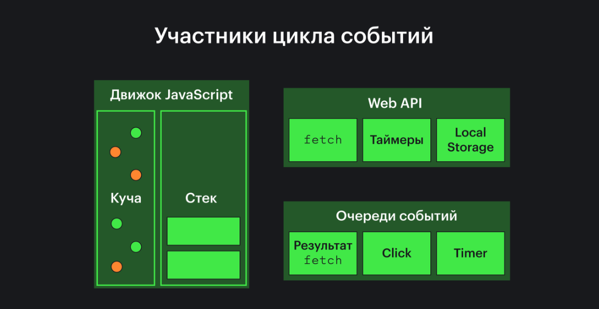
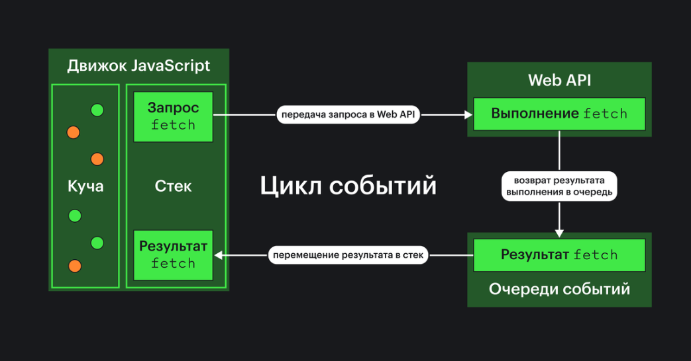

# **JavaScript**

## 1. **Что такое ECMAScript? В чём отличие от JavaScript?**

`ECMAScript` — это спецификация, стандарт скриптовых языков программирования, он является основой JS, поэтому любые изменения ECMAScript отражаются на JS.

`ECMAScript сам по себе - это не язык программирования`. А вот JavaScript - это язык программирования, реализующий стандарт ECMAScript.

### **`Что было добавлено в ES6:`**

1. Стрелочные функции и интерполяция в строках
2. Ключевое слово const
3. Блочная видимость
4. Параметры по умолчанию
5. Классы и наследование
6. Оператор for-of для перебора итерируемых объектов в цикле
7. spread и rest операторы
8. Обещания (Promises)
9. Модули

## 2. **Типы данных в JavaScript?**

- `number`
- `string`
- `boolean`
- `null`
- `undefined`
- `symbol`
- `bigint`
- `object`

## 3. **Что такое Symbol?**

`Символ (Symbol)` — тип данных, значения которого создаются с помощью вызова функции Symbol. Каждый созданный символ уникален.

Символы могут использоваться в качестве имён свойств в объектах. Символьные свойства могут быть прочитаны только при прямом обращении и не видны при обычных операциях.

Для создания символа нужно вызвать функцию Symbol:

```JavaScript
const sym = Symbol()
const symTwo = Symbol()

console.log(sym === symTwo)
// false
```

Символы используются для создания скрытых свойств объектов. В отличие от свойств, ключом которых является строка, символьные свойства может читать только владелец символа. Скрытые свойства не видны при его обходе с помощью for...in.

Это может пригодиться, когда необходимо добавить свойства объекту, который могут модифицировать другие части программы. Таким образом только вы сможете читать созданное свойство, а гарантия уникальности символов гарантирует и отсутствие конфликтов имён.

Символы активно используются внутри самого JavaScript, чтобы определять поведение объектов. Такие символы называются «хорошо известными» (well-known symbols).

Самый известный символ Symbol.iterator, который позволяет реализовать обход конструкции с помощью синтаксических конструкций for..of и спред-синтаксиса.

Полный список таких символов доступен в спецификации, но на практике он нужен нечасто.

## 4. **Что такое BigInt?**

`BigInt` — это тип данных для работы с целыми числами произвольной длины. Он используется, когда числа
превышают пределы стандартного числового типа `Number`. Создается с помощью функции `BigInt()`,
например, `BigInt(123456789012345678901234567890)`.

## 5. **Разница между let, const и var?**

### `var`
- поднимается в начало области видимости при компиляции (имеет область видимости функции)
- объявляет переменную, которая может быть перезаписана
- объявляет переменную, которая может быть переопределена

### `let`
- поднимается в начало области видимости при компиляции, но находится в tdz до момента инициализации (имеет блочную область видимости)
- объявляет переменную, которая может быть перезаписана
- объявляет переменную, которая не может быть переопределена

### `const`
- поднимается в начало области видимости при компиляции, но находится в tdz до момента инициализации (имеет блочную область видимости)
- объявляет переменную, которая не может быть перезаписана или переопределена

## 6. **Что такое временная мёртвая зона (temporal dead zone)?**

`Временная мёртвая зона` — это период времени между началом области видимости, где объявлена переменная с `let` или `const`, и
моментом, когда эта переменная инициализирована. В этот период доступ к переменной вызывает ошибку.

## 7. **Разница между Rest и Spread операторами?**

`Spread оператор (...)` используется для разложения массива или объекта на отдельные элементы или свойства.
Например, `[...arr]` или `{...obj}`.

`Rest оператор (...)` используется для сбора всех оставшихся аргументов функции в массив или свойства объекта в
объект. Например, `function(...args)` или `const {a, ...rest} = obj`.

## 8. **Что такое деструктуризация?**

`Деструктуризация` — это синтаксическая особенность, позволяющая извлекать значения из массивов или свойств из объектов и
присваивать их переменным. Например, для массива: `const [a, b] = [1, 2]`, для объекта: `const {x, y} = {x: 1, y: 2}`.

## 9. **Разница между == и === (нестрогое/строгое равенство)?**

`== (нестрогое равенство)` проверяет равенство значений с приведением типов. 

`=== (строгое равенство)` проверяет равенство значений без приведения типов.

## 10. **Что такое Strict mode в JavaScript?**

`Strict mode ("строгий режим")` вводит в код дополнительные проверки и ограничения для улучшения качества и безопасности кода. Включается директивой `"use strict";`.

## 11. **Разница между function declaration и function expression?**

`Function declaration (объявление функции)`: `function foo() { }` - имеет имя и доступна везде в текущей области видимости благодаря "всплытию".

`Function expression (функциональное выражение)`: `const foo = function() { }` - может быть анонимной или именованной, но доступно только после его объявления.

## 12. **Разница между обычными функциями и стрелочными?**

`Обычные функции` имеют собственное значение `this`, которое устанавливается в момент вызова функции. Также они
имеют свою собственную область видимости для `arguments`.

`Стрелочные функции` не имеют собственного `this`; вместо этого они захватывают значение `this` из окружающего
контекста. Они также не имеют `arguments` и не поддерживают `new`.

## 13. **Что такое генераторы? Когда стоит использовать генераторы?**

`Генераторы` — это функции, которые могут приостанавливать своё выполнение и потом возобновлять его. Они полезны, когда нужно работать с последовательностями данных или длительными асинхронными операциями, позволяя контролировать выполнение шаг за шагом.

### Особенности генераторов:
1. **Синтаксис**: Генераторы определяются с помощью функции с `*` (звёздочка) после ключевого слова `function`:

   ```javascript
   function* myGenerator() {
     yield 1;
     yield 2;
     yield 3;
   }
   ```

2. **Оператор `yield`**: Внутри генератора используется оператор `yield`, который приостанавливает выполнение функции и возвращает значение. После возобновления выполнение продолжается с места, где оно было остановлено:

   ```javascript
   const gen = myGenerator();

   console.log(gen.next()); // { value: 1, done: false }
   console.log(gen.next()); // { value: 2, done: false }
   console.log(gen.next()); // { value: 3, done: false }
   console.log(gen.next()); // { value: undefined, done: true }
   ```

3. **Метод `.next()`**: Генераторы возвращают специальный объект, имеющий метод `.next()`. Этот метод возвращает объект с двумя свойствами:
   - `value`: Значение, возвращаемое оператором `yield`.
   - `done`: Логическое значение, показывающее, завершён ли генератор.

4. **Асинхронные генераторы**: Помимо обычных генераторов существуют асинхронные, которые работают с промисами. Они объявляются с помощью `async function*` и могут использовать оператор `await` внутри себя.

   Пример:

   ```javascript
   async function* asyncGenerator() {
     yield await new Promise(resolve => setTimeout(() => resolve(1), 1000));
     yield await new Promise(resolve => setTimeout(() => resolve(2), 1000));
   }

   (async () => {
     for await (const value of asyncGenerator()) {
       console.log(value); // 1, 2 (с задержкой)
     }
   })();
   ```

### Где используются генераторы:
- **Итераторы**: Генераторы часто используются для создания итераторов. Они позволяют вам легко перебрать значения, например, с помощью цикла `for...of`.
- **Асинхронные процессы**: Генераторы могут использоваться для управления асинхронными задачами, особенно в сочетании с библиотеками, такими как `co`.
- **Работа с потоками данных**: Генераторы могут возвращать данные по требованию, что полезно при работе с большими массивами данных, которые не нужно загружать полностью в память.

## 14. **Разница между null и undefined?**

`undefined` представляет собой значение по умолчанию:
- переменной, которой не было присвоено значение;
- функции, которая ничего не возвращает явно, например, console.log(1);
- несуществующего свойства объекта.

`null` представляет собой значение, которое присваивается переменной явно.

При сравнении null и undefined мы получаем true, когда используем оператор ==, и false при использовании оператора ===.

## 15. **Типы таймеров в JavaScript?**

- `setTimeout`: выполняет функцию через определённое время.
- `setInterval`: выполняет функцию с заданным интервалом.
- `requestAnimationFrame`: выполняет функцию перед следующим перерисовкой экрана.

## 16. **Что такое поднятие (Hoisting)?**

`Поднятие` - это механизм, при котором объявления переменных и функций "поднимаются" в верхнюю часть их
области видимости во время компиляции.

## 17. **Что такое область видимости (Scope)?**

`Область видимости` — это область, ограничивающая доступ к переменным и функциям внутри себя, как бы инкапсулирующая их.

### **`JS имеет три типа областей видимости:`**

`Глобальная` — переменные и функции, объявленные в глобальном пространстве имен, имеют глобальную область видимости и
доступны из любого места в коде.

`Функциональная` — переменные, функции и параметры, объявленные внутри функции, доступны только внутри этой функции.

`Блочная` — переменные, объявленные с помощью ключевых слов let и const, доступны только внутри блока {}, в котором
были
объявлены.

`Область видимости` — это также набор правил, по которым осуществляется поиск переменной. Если переменной не
существует в
текущей области видимости, ее поиск производится выше, во внешней по отношению к текущей области видимости. Если и во
внешней области видимости переменная отсутствует, ее поиск продолжается вплоть до глобальной области видимости. Если в
глобальной области видимости переменная обнаружена, поиск прекращается, если нет — выбрасывается исключение. Поиск
осуществляется по ближайшим к текущей областям видимости и останавливается с нахождением переменной. Это называется
цепочкой областей видимости (Scope Chain).

## 18. **Что такое замыкание (Closure)?**

`Замыкание` — это способность функции во время создания запоминать ссылки на переменные и параметры, находящиеся в текущей области видимости.

## 19. **Что обозначает this в JavaScript?**

`this` ссылается на контекст выполнения функции. 

В глобальной области видимости `this` ссылается на глобальный
объект (`window` в браузере).

Контекст `this` зависит от того, `как функция была вызвана`, а `не от того, где она была определена`.

`this` в JavaScript имеет разные значения в зависимости от контекста, в котором он используется:

### 1. **`this в объекте`**

Когда `this` используется внутри метода объекта, он ссылается на сам объект, который вызвал этот метод. Например:

```javascript
const person = {
  name: 'Anton',
  greet() {
    console.log(`Hello, my name is ${this.name}`);
  }
};

person.greet(); // Вывод: Hello, my name is Anton
```

### 2. **`this в конструкторе или классе`**

Когда `this` используется в классе, он ссылается на экземпляр этого класса. Например:

```javascript
class Person {
  constructor(name) {
    this.name = name;
  }
  
  greet() {
    console.log(`Hello, my name is ${this.name}`);
  }
}

const anton = new Person('Anton');
anton.greet(); // Вывод: Hello, my name is Anton
```

## 20. **Что такое функции высшего порядка (Higher Order Functions)?**

`Функции высшего порядка` - это функции, которые принимают другие функции в качестве аргументов или возвращают их.

## 21. **Как превратить любой тип данных в булевый? Перечислите ложные значения в JS?**

  Преобразование в булевый тип можно сделать через функцию `Boolean()` или оператор `!!`. Ложные
  значения: `false`, `0`, `-0`, `0n`, `""` (пустая строка), `null`, `undefined`, `NaN`.

## 22. **Что такое шаблонные литералы (Template Literals)?**

`Шаблонные литералы` — это строки, которые могут содержать выражения и многострочные тексты. Они создаются с помощью
обратных кавычек (`` ` ``). Например: `` `Hello, ${name}` ``. Это позволяет легко вставлять переменные и выполнять
выражения в строках.

## 23. **Что такое итератор?**

`Итератор` — это объект, который умеет обращаться к элементам коллекции по одному за раз, при этом отслеживая своё текущее положение внутри этой последовательности.

Иными словами итератор — механизм, который позволяет перемещаться (итерироваться) по элементам коллекции в определённом порядке и делает их доступными.

Итератор должен реализовывать метод `next()`, который возвращает объект с двумя свойствами: `value` (текущее
значение) и `done` (флаг завершения итерации).

Чтобы объект был итерируемым, он должен реализовывать метод `@@iterator`. Это означает, что объект или один из объектов в цепочке прототипов имеет свойство `Symbol.iterator`.

## 24. **Методы объектов в JavaScript?**

1. **`Object.keys()`**
Возвращает массив строк, представляющих все перечисляемые свойства объекта (ключи).
```javascript
const user = { name: 'Anton', age: 25 };
console.log(Object.keys(user)); // ['name', 'age']
```

2. **`Object.values()`**
Возвращает массив значений свойств объекта.
```javascript
const user = { name: 'Anton', age: 25 };
console.log(Object.values(user)); // ['Anton', 25]
```

3. **`Object.entries()`**
Возвращает массив пар `[ключ, значение]` для всех перечисляемых свойств объекта.
```javascript
const user = { name: 'Anton', age: 25 };
console.log(Object.entries(user)); // [['name', 'Anton'], ['age', 25]]
```

4. **`Object.assign()`**
Копирует значения всех перечисляемых свойств из одного или более исходных объектов в целевой объект.
```javascript
const target = { name: 'Anton' };
const source = { age: 25 };
const result = Object.assign(target, source);
console.log(result); // { name: 'Anton', age: 25 }
```

5. **`Object.freeze()`**
"Замораживает" объект, предотвращая добавление новых свойств, изменение или удаление существующих.
```javascript
const user = { name: 'Anton' };
Object.freeze(user);
user.age = 25; // Не сработает
console.log(user); // { name: 'Anton' }
```

6. **`Object.seal()`**
"Запечатывает" объект, позволяя изменять существующие свойства, но предотвращая добавление или удаление новых.
```javascript
const user = { name: 'Anton' };
Object.seal(user);
user.name = 'Sergey'; // Сработает
user.age = 25; // Не сработает
console.log(user); // { name: 'Sergey' }
```

7. **`Object.create()`**
Создает новый объект с указанным прототипом и свойствами.
```javascript
const proto = { greeting: 'Hello' };
const obj = Object.create(proto);
console.log(obj.greeting); // 'Hello'
```

8. **`Object.hasOwnProperty()`**
Проверяет, является ли указанное свойство собственным свойством объекта (не наследуется).
```javascript
const user = { name: 'Anton' };
console.log(user.hasOwnProperty('name')); // true
console.log(user.hasOwnProperty('age'));  // false
```

Object.preventExtensions(obj)
Запрещает добавлять новые свойства в объект.
Object.seal(obj)
Запрещает добавлять/удалять свойства. Устанавливает configurable: false для всех существующих свойств.
Object.freeze(obj)
Запрещает добавлять/удалять/изменять свойства. Устанавливает configurable: false, writable: false для всех существующих свойств.
А также есть методы для их проверки:

Object.isExtensible(obj)
Возвращает false, если добавление свойств запрещено, иначе true.
Object.isSealed(obj)
Возвращает true, если добавление/удаление свойств запрещено и для всех существующих свойств установлено configurable: false.
Object.isFrozen(obj)
Возвращает true, если добавление/удаление/изменение свойств запрещено, и для всех текущих свойств установлено configurable: false, writable: false.

## 25. **Методы строк в JavaScript?**

- **`length`** – возвращает длину строки.
   ```js
   const str = "Hello, World!";
   console.log(str.length); // 13
   ```

- **`toUpperCase()`** – преобразует все символы строки в верхний регистр.
   ```js
   const str = "hello";
   console.log(str.toUpperCase()); // "HELLO"
   ```

- **`toLowerCase()`** – преобразует все символы строки в нижний регистр.
   ```js
   const str = "HELLO";
   console.log(str.toLowerCase()); // "hello"
   ```

- **`charAt(index)`** – возвращает символ строки по указанному индексу.
   ```js
   const str = "JavaScript";
   console.log(str.charAt(0)); // "J"
   ```

- **`includes(substring)`** – проверяет, содержит ли строка подстроку.
   ```js
   const str = "Hello, World!";
   console.log(str.includes("World")); // true
   ```

- **`indexOf(substring)`** – возвращает индекс первого вхождения подстроки, или -1, если подстрока не найдена.
   ```js
   const str = "Hello, World!";
   console.log(str.indexOf("World")); // 7
   ```

- **`slice(start, end)`** – извлекает часть строки с указанного индекса до конца или до заданного индекса.
   ```js
   const str = "Hello, World!";
   console.log(str.slice(7, 12)); // "World"
   ```

- **`substring(start, end)`** – аналогичен методу `slice()`, но не поддерживает отрицательные индексы.
   ```js
   const str = "JavaScript";
   console.log(str.substring(4, 10)); // "Script"
   ```

- **`replace(searchValue, newValue)`** – заменяет первую найденную подстроку на новую строку.
   ```js
   const str = "Hello, World!";
   console.log(str.replace("World", "JavaScript")); // "Hello, JavaScript!"
   ```

- **`split(separator)`** – разбивает строку на массив строк по указанному разделителю.
    ```js
    const str = "apple, banana, cherry";
    const arr = str.split(", ");
    console.log(arr); // ["apple", "banana", "cherry"]
    ```

- **`trim()`** – удаляет пробелы в начале и конце строки.
    ```js
    const str = "   Hello, World!   ";
    console.log(str.trim()); // "Hello, World!"
    ```

- **`repeat(count)`** – возвращает новую строку, повторённую указанное количество раз.
    ```js
    const str = "Hi! ";
    console.log(str.repeat(3)); // "Hi! Hi! Hi! "
    ```

- **`concat(...strings)`** – объединяет строки.
    ```js
    const str1 = "Hello";
    const str2 = "World";
    console.log(str1.concat(", ", str2)); // "Hello, World"
    ```

## 26. **Методы массивов в JavaScript? Мутирующие методы массива?**
    
Смотреть большинство методов здесь: - https://doka.guide/js/

`Мутирующие методы` массива в JavaScript изменяют сам массив, на котором они вызываются:

1. **`push()`** — добавляет элементы в конец массива.
2. **`pop()`** — удаляет последний элемент массива.
3. **`shift()`** — удаляет первый элемент массива.
4. **`unshift()`** — добавляет элементы в начало массива.
5. **`splice()`** — добавляет или удаляет элементы по указанному индексу.
6. **`sort()`** — сортирует элементы массива на месте.
7. **`reverse()`** — изменяет порядок элементов на противоположный.
8. **`fill()`** — заполняет массив статическим значением.
9. **`copyWithin()`** — копирует часть массива в другое место внутри этого же массива.
10. **`splice()`** — добавляет или удаляет элементы из массива по указанному индексу.
11. **`shift()`** — удаляет первый элемент массива и возвращает его.
12. **`unshift()`** — добавляет один или несколько элементов в начало массива и возвращает новую длину массива.
13. **`sort()`** — сортирует элементы массива на месте и возвращает отсортированный массив.
14. **`reverse()`** — изменяет порядок элементов массива на противоположный.
15. **`concat()`** — не мутирующий метод, но часто используется вместе с мутирующими методами, добавляя элементы к массиву.

## 27. **Что такое чистая функция?**

`Чистая функция` - это функция, которая:
- Всегда возвращает один и тот же результат для одних и тех же аргументов.
- Не имеет побочных эффектов.

## 28. **Разница между .call(), .apply() и bind()?**

- `.call()`: вызывает функцию с указанным `this` и аргументами, переданными по отдельности.
- `.apply()`: вызывает функцию с указанным `this` и аргументами, переданными в виде массива.
- `.bind()`: возвращает новую функцию с указанным `this` и частично переданными аргументами.

## 29. **Почему в JS функции называют объектами первого класса?**

`Функции являются объектами первого класса`, потому что их можно передавать как аргументы, возвращать из других
функций и присваивать переменным.

## 30. **Что такое IIFE?**

`IIFE или Immediately Invoked Function Expression` — это функция, которая вызывается или выполняется сразу же после создания или объявления:

```javascript
(function() { /* code */ })();
```

## 31. **Что такое псевдомассив arguments?**

`arguments `— это коллекция аргументов, передаваемых функции. Он имеет свойство length и поддерживает обращение по индексу к элементам, но не является массивом, из-за чего не имеет методов forEach, reduce, filter, map и так далее.

В стрелочных функциях объект arguments не работает.

## 32. **Разница между host-объектами и нативными объектами?**

`Нативные объекты` - встроенные объекты JavaScript (`Object`, `Array`, и т.д.).

`Host-объекты` - объекты, предоставленные средой выполнения (например, браузерные объекты, такие
как `window`, `document`).

## 33. **Почему результат сравнения 2х объектов это false? Как сравить два объекта?**

В JavaScript `объекты сравниваются по ссылке`, а `не по значению`. Два разных объекта будут всегда не равны друг другу,
даже если они содержат одинаковые данные.

Вот несколько способов для сравнения объектов в JavaScript:

### 1. **`Поверхностное сравнение (Shallow Compare)`**

```js
function shallowEqual(obj1, obj2) {
  const keys1 = Object.keys(obj1);
  const keys2 = Object.keys(obj2);

  if (keys1.length !== keys2.length) {
    return false;
  }

  for (let key of keys1) {
    if (obj1[key] !== obj2[key]) {
      return false;
    }
  }

  return true;
}
```

### 2. **`Глубокое сравнение (Deep Compare)`**


```js
function deepEqual(obj1, obj2) {
  if (obj1 === obj2) {
    return true; // Объекты идентичны по ссылке
  }

  if (typeof obj1 !== 'object' || typeof obj2 !== 'object' || obj1 === null || obj2 === null) {
    return false; // Если это не объекты или один из них null
  }

  const keys1 = Object.keys(obj1);
  const keys2 = Object.keys(obj2);

  if (keys1.length !== keys2.length) {
    return false;
  }

  for (let key of keys1) {
    if (!keys2.includes(key) || !deepEqual(obj1[key], obj2[key])) {
      return false;
    }
  }

  return true;
}
```

### 3. **`Сравнение с помощью JSON.stringify`**


```js
const areEqual = JSON.stringify(obj1) === JSON.stringify(obj2);
```
- `Плюсы`: Быстрый и простой способ сравнения.
- `Минусы`: Не работает корректно, если порядок свойств разный или если объекты содержат функции, `undefined`, `Date` и другие специальные типы данных.

### 4. **`Использование библиотеки Lodash`**


```js
const _ = require('lodash');
const areEqual = _.isEqual(obj1, obj2);
```
- `Плюсы`: Очень мощное и гибкое решение для глубокого сравнения любых объектов.
- `Минусы`: Необходима установка библиотеки.

### 6. **`Использование библиотеки fast-deep-equal`**

```js
const deepEqual = require('fast-deep-equal');
const areEqual = deepEqual(obj1, obj2);
```
- `Плюсы`: Очень быстрая библиотека для глубокого сравнения.
- `Минусы`: Необходима установка библиотеки.

## 34. **Что такое прототипное наследование? Как создать объект без прототипа?**

`Прототипное наследование` - механизм, при котором объекты могут наследовать 
свойства и методы от другого объекта (прототипа). 

Объект без прототипа можно создать с помощью `Object.create(null)`.

## 35. **Что такое NaN? Как определить, что значение равно NaN?**

`NaN (Not-a-Number)` - специальное значение, которое указывает, что результат операции не является числом.

Определить `NaN` можно с помощью функции `isNaN()` (Преобразует переданное значение в число, если это возможно, и затем проверяет, является ли оно NaN) или метода `Number.isNaN()` (Проверяет только те значения, которые уже являются NaN, и не выполняет никакого преобразования).

## 36. **Что такое объектная обертка (Wrapper Objects)?**

Объектные обертки (`String`, `Number`, `Boolean`, `Symbol` и `BigInt`) позволяют работать с примитивными значениями как с объектами,
предоставляя методы и свойства.

## 37. **Как в JavaScript создать объект?**

- Литерал объекта: `{ key: value }`
- `new Object()`
- `Object.create(proto)`

## 38. **Дескрипторы?**

Помимо значения `value`, свойства объекта имеют `три специальных атрибута` (так называемые «флаги»).

`writable` – если true, свойство можно изменить, иначе оно только для чтения.
`enumerable` – если true, свойство перечисляется в циклах, в противном случае циклы его игнорируют.
`configurable` – если true, свойство можно удалить, а эти атрибуты можно изменять, иначе этого делать нельзя.
`Обратите внимание: configurable: false` не даст изменить флаги свойства, а также не даст его удалить. При этом можно изменить значение свойства.

Метод `Object.getOwnPropertyDescriptor` позволяет получить полную информацию о свойстве.

```js
let user = {
  name: "John"
};

let descriptor = Object.getOwnPropertyDescriptor(user, 'name');

alert( JSON.stringify(descriptor, null, 2 ) );
/* дескриптор свойства:
{
  "value": "John",
  "writable": true,
  "enumerable": true,
  "configurable": true
}
*/
```

Чтобы изменить флаги, мы можем использовать метод `Object.defineProperty`.
```js
Object.defineProperty(obj, propertyName, descriptor)
```
`obj, propertyName`
Объект и его свойство, для которого нужно применить дескриптор.
`descriptor`
Применяемый дескриптор.

Если свойство существует, defineProperty обновит его флаги. В противном случае метод создаёт новое свойство с указанным значением и флагами; если какой-либо флаг не указан явно, ему присваивается значение false.

Существует метод Object.defineProperties(obj, descriptors), который позволяет определять множество свойств сразу.

Его синтаксис:
```js
Object.defineProperties(obj, {
  prop1: descriptor1,
  prop2: descriptor2
  // ...
});
```

Например:

```js
Object.defineProperties(user, {
  name: { value: "John", writable: false },
  surname: { value: "Smith", writable: false },
  // ...
});
```
Чтобы получить все дескрипторы свойств сразу, можно воспользоваться методом Object.`getOwnPropertyDescriptors(obj)`.


## 39. **Для чего используется ключевое слово new?**

`Ключевое слово new` используется в функциях-конструкторах для создания нового объекта (нового экземпляра класса).

Ключевое слово `new` делает 4 вещи:

1. Создает пустой объект.
2. Привязывает к нему значение this.
3. Возвращает значение this, если не указано иное.

## 40. **Что такое Set, Map, WeakMap и WeakSet?**

`Map` — коллекция пар "ключ-значение", где ключи могут быть любого типа. Порядок элементов в Map сохраняется.

**Методы и свойства:**

- **new Map()** – создаёт коллекцию.
- **Map.prototype.set(key, value)** – записывает по ключу key значение value.
- **Map.prototype.get(key)** – возвращает значение по ключу или undefined, если ключ key отсутствует.
- **Map.prototype.has(key)** – возвращает true, если ключ key присутствует в коллекции, иначе false.
- **Map.prototype.delete(key)** – удаляет элемент (пару «ключ/значение») по ключу key.
- **Map.prototype.clear()** – очищает коллекцию от всех элементов.
- **Map.prototype.size** – возвращает текущее количество элементов.

**Для перебора коллекции Map:**

- **Map.prototype.keys()** – возвращает итерируемый объект по ключам,
- **Map.prototype.values()** – возвращает итерируемый объект по значениям,
- **Map.prototype.entries()** – возвращает итерируемый объект по парам вида [ключ, значение], этот вариант используется
  по умолчанию в for..of.

`Set` — коллекция уникальных значений. Значения в Set могут быть любого типа и не повторяются.

**Его основные методы это:**

- **new Set(iterable)** – создаёт Set, и если в качестве аргумента был предоставлен итерируемый объект (обычно это
  массив), то копирует его значения в новый Set.
- **Set.prototype.add(value)** – добавляет значение (если оно уже есть, то ничего не делает), возвращает тот же объект
  Set.
- **Set.prototype.delete(value)** – удаляет значение, возвращает true, если value было в множестве на момент вызова,
  иначе false.
- **Set.prototype.has(value)** – возвращает true, если значение присутствует в множестве, иначе false.
- **Set.prototype.clear()** – удаляет все имеющиеся значения.
- **Set.prototype.size** – возвращает количество элементов в множестве.

**Для перебора коллекции Set:**

- **Set.prototype.keys()** – возвращает перебираемый объект для значений,
- **Set.prototype.values()** – то же самое, что и set.keys(), присутствует для обратной совместимости с Map,
- **Set.prototype.entries()** – возвращает перебираемый объект для пар вида [значение, значение], присутствует для
  обратной совместимости с Map.

`WeakMap` — аналог Map, но ключи должны быть объектами, и они не предотвращают сборку мусора. Это позволяет автоматически очищать неиспользуемые ключи.

`WeakSet` — аналог Set, но элементы могут быть только объектами, и они не предотвращают сборку мусора.

`WeakSet и WeakMap` – это специальные структуры данных в JavaScript, которые отличаются особенностью хранения ссылок на объекты.

В обычных `Set и Map` хранятся сильные ссылки на объекты. Это значит, что пока существует ссылка на объект в этих структурах, сборщик мусора не удалит этот объект из памяти, даже если больше нигде в коде нет ссылок на него.

И напротив, в WeakSet и WeakMap хранятся слабые ссылки. Это означает, что если объект, на который есть ссылка в этих структурах, больше недоступен в коде (т.е. нигде больше нет сильных ссылок на него), то сборщик мусора может удалить этот объект из памяти, даже если в WeakSet или WeakMap все еще есть ссылка на него. Таким образом, использование слабых ссылок позволяет не держать в памяти ненужные больше объекты и экономить память.

Кроме того, в WeakMap в качестве ключей могут использоваться только объекты, а не примитивные значения. А в WeakSet хранятся только объекты, без ключей.

## 41. **Операторы «И» и «ИЛИ» (&& и ||)?**

`&& (И)`: возвращает первое ложное значение или последнее истинное.

`|| (ИЛИ)`: возвращает первое истинное значение или последнее ложное.

## 42. **Что такое оператор логического присваивания?**

`Оператор логического присваивания` сочетает логическое действие с присваиванием. Например, `x &&= y`
эквивалентен `x && (x = y)`.

## 43. **Что такое оператор нулевого слияния (??)?**

`?? (оператор нулевого слияния)`: возвращает первое значение не равное `null` или `undefined`
или последнее равное `null` или `undefined`.

## 44. **Расскажите об операторе Optional Chaining (?.)?**

`Оператор Optional Chaining (?.)` позволяет безопасно обращаться к вложенным свойствам объекта, не вызывая ошибку,
если одно из промежуточных свойств `null` или `undefined`. Например, `obj?.property?.subProperty`.

## 45. **Как работает boxing/unboxing в JavaScript?**

`Boxing` - это процесс оборачивания примитива в объектную обертку, например, при доступе к свойствам или методам
примитивного значения. 

`Unboxing` - обратный процесс, когда объектная обертка преобразуется обратно в примитив.

## 46. **Как определить наличие свойства в объекте? Разница между оператором in и методом .hasOwnProperty()?**

- `in` проверяет наличие свойства в объекте и его прототипах.
- `.hasOwnProperty()` проверяет наличие свойства только в самом объекте.

## 47. **Разница между глубокой (deep) и поверхностной (shallow) копиями объекта? Как сделать каждую из них?**

`Поверхностная копия (shallow)` копирует только верхний уровень объекта. Например, с помощью `Object.assign()` или оператора
распространения `{ ...obj }`.

`Глубокая копия (deep)` копирует все уровни вложенности объекта. Например, с помощью `JSON.parse(JSON.stringify(obj))` или
библиотек вроде `lodash`.

## 48. **Как передаются параметры в функцию: по ссылке или по значению?**

Примитивные типы передаются `по значению`, объекты передаются `по ссылке`.

## 49. **Что такое прототип объекта в JavaScript?**

`Прототип объекта` - это объект, от которого другой объект наследует свойства и методы.

## 50. **Типы всплывающих окон в JavaScript?**

1. `alert()`: 
- Выводит сообщение с кнопкой "ОК". 
- Пример: 
```javascript
alert("Это сообщение!");
```

2. `confirm()`: 
- Отображает сообщение с двумя кнопками: "ОК" и "Отмена". Возвращает `true`, если нажата "ОК", и `false`, если "Отмена".
- Пример:
```javascript
let result = confirm("Вы уверены?");
if (result) {
    console.log("Пользователь подтвердил.");
} else {
    console.log("Пользователь отменил.");
}
```

3. `prompt()`: 
- Позволяет пользователю ввести текст. Возвращает введенное значение или `null`, если пользователь нажал "Отмена".
- Пример:
```javascript
let name = prompt("Введите ваше имя:");
if (name !== null) {
    console.log("Привет, " + name + "!");
}
```

## 51. **Типы ошибок в JavaScript?**

`Error` - Общий конструктор ошибок. 
```js 
new Error('Общая ошибка. Проверьте код')
```
Вызов конструктора возвращает объект ошибки со следующими свойствами:

`message` представляет понятное человеку описание ошибки для встроенных типов `(SyntaxError, TypeError и так далее)` и переданное в конструктор значение для общего типа Error;
`name` — имя типа (класса) ошибки.


```js
const commonError = new Error('Общая ошибка. Проверьте код')

console.log(commonError.message)
// 'Общая ошибка. Проверьте код'

console.log(commonError.name)
// 'Error'
```

1. `SyntaxError`
Чаще всего встречаются опечатки — неправильные названия методов, лишние или отсутствующие точки с запятой или скобочки и так далее. Такой тип ошибок называется «синтаксическим», SyntaxError:
```js
console.log(;)
// SyntaxError: Unexpected token ';'

console.log(()
// SyntaxError: missing ) after argument list
```

2. `ReferenceError`
Если попытаться обратиться к несуществующей переменной, произойдёт ошибка ReferenceError:
```js
console.log(name)
// ReferenceError: name is not defined
```

3. `TypeError`
Если попытаться обратиться к несуществующему свойству, произойдёт ошибка TypeError:
```js
console.log(null.length)
// TypeError: Cannot read property 'length' of null

undefined()
// TypeError: undefined is not a function
```

4. `RangeError`
Ошибка для значений, которые выходят за диапазон допустимого:
```js
new Array(10000000000)
// RangeError: Недопустимая длина массива
```

5. `URIError`
Этот тип ошибок возникает при неправильном использовании обработки URI:
```js
decodeURIComponent('%')
// URIError: URI malformed
```

6. `EvalError`
EvalError представляет ошибку, возникающую в глобальной функции eval():
```js
eval(
  'console.log(null.length)'
)
```
Эта ошибка в настоящее время не используется и остаётся для совместимости с предыдущими версиями JavaScript.

## 52. **Разница между typeof и instanceof?**

`typeof` возвращает строку, указывающую тип примитива или объекта.

`instanceof` проверяет, является ли объект экземпляром определенного конструктора.

## 53. **Что такое регулярное выражение (Regular Expression)? Какие методы используются в регулярных выражениях?**

`Регулярное выражение (Regular Expression, или regex)` — это последовательность символов, которая описывает шаблон для поиска или обработки строк. Регулярные выражения позволяют выполнять сложные операции поиска и замены, а также валидацию данных в строках.

### `Основные понятия регулярных выражений:`

1. **`Литералы`**: Это простые символы, которые представляют собой сами себя, например, `a`, `b`, `1`, `2` и т.д.

2. **`Специальные символы`**: Некоторые символы имеют специальное значение:
- `.` — любой символ (кроме новой строки)
- `*` — 0 или более повторений предыдущего символа
- `+` — 1 или более повторений предыдущего символа
- `?` — 0 или 1 повторение предыдущего символа
- `^` — начало строки
- `$` — конец строки
- `[]` — класс символов (например, `[a-z]` — любой символ от a до z)
- `()` — группировка (например, `(abc)` будет соответствовать строке "abc")
- `|` — логическое "или" (например, `a|b` соответствует либо "a", либо "b")

3. **`Экранирование`**: Для использования специальных символов как литералов их нужно экранировать с помощью обратного слэша (`\`). Например, чтобы искать символ `.` (точка), нужно использовать `\.`.

### `Методы для работы с регулярными выражениями в JavaScript:`

1. **`RegExp`**: Конструктор для создания регулярных выражений.
```javascript
const regex = new RegExp('abc'); // Создание регулярного выражения
```

2. **`String.prototype.match()`**: Возвращает массив совпадений или `null`, если совпадений не найдено.
```javascript
const str = 'abcdef';
const result = str.match(/abc/); // ['abc']
```

3. **`String.prototype.replace()`**: Заменяет найденные совпадения на другой текст.
```javascript
const str = 'abcdef';
const newStr = str.replace(/abc/, 'xyz'); // 'xyzdef'
```

4. **`String.prototype.search()`**: Возвращает индекс первого совпадения или -1, если совпадения не найдены.
```javascript
const str = 'abcdef';
const index = str.search(/abc/); // 0
```

5. **`String.prototype.split()`**: Разделяет строку на массив по заданному шаблону.
```javascript
const str = 'a,b,c';
const arr = str.split(/,/); // ['a', 'b', 'c']
```

6. **`RegExp.prototype.test()`**: Проверяет, есть ли совпадения с регулярным выражением в строке.
```javascript
const regex = /abc/;
const result = regex.test('abcdef'); // true
```

### `Пример использования:`

```javascript
const email = 'example@test.com';
const emailRegex = /^[a-zA-Z0-9._%+-]+@[a-zA-Z0-9.-]+\.[a-zA-Z]{2,}$/;

if (emailRegex.test(email)) {
    console.log('Email valid');
} else {
    console.log('Email invalid');
}
```

## 54. **Что такое полифил (polyfill)?**

`Полифил (polyfill)` — это код, который добавляет функциональность в браузеры, 
которые не поддерживают определенные функции или методы, 
предусмотренные в современных версиях языков или спецификаций. 
Полифилы позволяют разработчикам использовать новые возможности без необходимости ожидать, 
пока все пользователи обновят свои браузеры.

`Полифилы` позволяют использовать новые функции JavaScript, такие как методы массива, промисы, `fetch` и другие, в браузерах, которые не поддерживают их.

Если какой-то метод, например, `Array.prototype.includes`, не поддерживается в старых браузерах, полифил может быть реализован следующим образом:

```javascript
if (!Array.prototype.includes) {
    Array.prototype.includes = function(element) {
        return this.indexOf(element) !== -1;
    };
}
```

## 55. **Типы операторов в JavaScript?**

- `Арифметические`: `+`, `-`, `*`, `/`, `%`
- `Сравнения`: `==`, `===`, `!=`, `!==`, `>`, `<`, `>=`, `<=`
- `Логические`: `&&`, `||`, `!`
- `Присваивания`: `=`, `+=`, `-=`, `*=`, `/=`
- `Побитовые`: `&`, `|`, `^`, `~`, `<<`, `>>`, `>>>`
- `Специальные`: `typeof`, `instanceof`, `new`, `delete`, `void`, `in`

## 56. **Правила задания имён для переменных и функций в JavaScript?**

- Должны начинаться с буквы, знака доллара `$` или подчеркивания `_`.
- Не могут начинаться с цифры.
- Должны быть понятными и описательными.
- Не должны быть зарезервированными словами.

## 57. **Разница между явным и неявным преобразованием (Implicit and Explicit Coercion)?**

`Явное преобразование`: программист явно указывает преобразование типа (`Number()`, `String()`, `Boolean()`).

`Неявное преобразование`: JavaScript автоматически преобразует типы в процессе выполнения.

## 59. **Что такое каррирование?**

`Каррирование` — это техника в функциональном программировании, которая позволяет преобразовывать функцию с несколькими аргументами в последовательность функций, каждая из которых принимает один аргумент. Это означает, что вместо того чтобы передавать все аргументы функции одновременно, вы передаете их по одному.

Например, представим функцию, которая принимает два аргумента:

```javascript
function add(x, y) {
    return x + y;
}
```

С помощью каррирования эту функцию можно преобразовать в следующую:

```javascript
function curriedAdd(x) {
    return function(y) {
        return x + y;
    };
}
```

Теперь вы можете использовать эту функцию так:

```javascript
const addFive = curriedAdd(5);
console.log(addFive(3)); // Вывод: 8
```


## 60. **Как работает «сборщик мусора» в JavaScript?**

`Сборщик мусора` автоматически освобождает память, удаляя объекты, которые больше не доступны или не используются.

## 61. **Что такое утечки памяти? Назовите основные типы утечек памяти в JavaScript?**

`Утечки памяти` возникают, когда программа продолжает потреблять память, не освобождая ее после использования, что
может привести к исчерпанию памяти.

### **`Распространенные типы утечек памяти:`**

1. **`Задержки ссылок (Reference Retention):`**
   - Когда объект остаётся доступным из других объектов, даже если он больше не нужен. Это может произойти, если вы храните ссылки на объекты в глобальных переменных или в замыканиях.

2. **`Замыкания (Closures):`**
   - Замыкания позволяют функции захватывать переменные из своей внешней области видимости. Если такие функции сохраняются и используются долгое время, они могут удерживать ссылки на объекты, которые должны быть освобождены.

3. **`Обработчики событий (Event Handlers):`**
   - Если обработчики событий не удаляются после их использования, они могут удерживать ссылки на элементы DOM или другие объекты, что мешает сборщику мусора освободить их.

4. **`Неочищенные таймеры и интервалы (Uncleared Timers and Intervals):`**
   - Таймеры (например, `setTimeout` и `setInterval`), которые не очищаются после завершения их работы, могут удерживать ссылки на функции и объекты, предотвращая их освобождение.

5. **`Кэширование (Caching):`**
   - Если объекты кэшируются и не очищаются, это может привести к накоплению ненужных данных в памяти. Нужно следить за тем, чтобы кэш не увеличивался без необходимости.

6. **`Неосвобождённые DOM-элементы:`**
   - Если вы создаёте элементы DOM и не удаляете их, они остаются в памяти, даже если они не отображаются на странице.

7. **`Ошибки в библиотеках и фреймворках:`**
   - Некоторые библиотеки могут иметь свои собственные утечки памяти из-за неправильного управления памятью. Это особенно актуально для устаревших или плохо поддерживаемых библиотек.

## 62. **Как работает контекст выполнения (execution context) в JavaScript?**

`Контекст выполнения (execution context)` — это концепция, которая описывает среду, в которой выполняется текущий код. Это важная часть механизма выполнения JavaScript-кода, которая управляет областью видимости переменных и определяет, как и где они могут быть доступны.

### `Основные типы контекстов выполнения:`
1. **`Глобальный контекст выполнения:`**
    - Это контекст выполнения по умолчанию для любого JavaScript-кода.
    - В браузере глобальный контекст привязан к объекту `window`, а в Node.js — к объекту `global`.
    - Все переменные и функции, объявленные на глобальном уровне, принадлежат этому контексту.

2. **`Контекст выполнения функции:`**
    - Создается каждый раз, когда вызывается функция.
    - Внутри функции создается собственная локальная область видимости для переменных и функций.
    - При каждом вызове функции создается новый контекст выполнения для этой конкретной функции.

### `Фазы контекста выполнения:`
**`Фаза создания (Creation Phase, интерпретация):`**

  JavaScript-движок создает контекст выполнения, но не выполняет код:

  1. `Создается объект переменных (лексическое окружение):`
  - Содержит все переменные, функции и параметры, определенные в контексте функции или глобальном контексте.
  - Происходит всплытие (hoisting).
  - В случае функции создается псевдомассив `arguments`, который содержит аргументы, переданные функции при вызове.
  
  2. `Создается область видимости (Scope) и цепочка областей видимости (Scope Chain):`
  - **Область видимости** — это область, ограничивающая доступ к переменным и функциям внутри себя, инкапсулирующая их.
  - Цепочка областей видимости обеспечивает поиск переменных в контексте функции, если они не найдены в текущем контексте.

  3. `Устанавливается ключевое слово this:`
  - Значение `this` зависит от того, как была вызвана функция.
  - В глобальном контексте `this` ссылается на глобальный объект (например, `window` в браузере).
  - В контексте функции значение `this` определяется способом вызова функции (например, может быть объектом, который вызывает метод).

**`Фаза исполнения (Execution Phase, выполнение):`**

  После завершения фазы создания движок начинает выполнять код построчно.

## 63. **Разница между примитивом и объектом?**

`Примитивы` (числа, строки, булевые значения, `null`, `undefined`, `symbol`, `bigint`) хранятся непосредственно по
  значению.

`Объекты` хранятся по ссылке и могут содержать множество значений и методов.

## 64. **Почему typeof null возвращает object?**

`typeof null == 'object'` всегда будет возвращать `true` по историческим причинам.

От сообщества поступало предложение исправить эту ошибку, изменив `typeof null = 'object'` на `typeof null = 'null'`, но оно было отклонено в интересах сохранения обратной совместимости (такое изменение повлекло бы за собой большое количество ошибок).

Для проверки, является ли значение `null` можно использовать оператор строгого равенства `===`:

```javascript
function isNull(value){
  return value === null
}
```

## 65. **Что такое модули, import/export?**

`ES6 модули` позволяют организовывать код в модули, которые могут экспортировать и импортировать функциональность.
Модули поддерживаются нативно в JavaScript и позволяют использовать ключевые слова `import` и `export` для работы с
модулями.

Модули позволяют объединять (использовать) код из разных файлов и избавляют нас от необходимости держать весь код в одном большом файле.

## 66. **Proxy и Reflect?**

`Прокси (Proxy)` – это обёртка вокруг объекта, которая «по умолчанию» перенаправляет операции над ней на объект, но имеет возможность перехватывать их.

Проксировать можно любой объект, включая классы и функции.
```js
let proxy = new Proxy(target, {
  /* ловушки */
});
```
…Затем обычно используют прокси везде вместо оригинального объекта target. Прокси не имеет собственных свойств или методов. Он просто перехватывает операцию, если имеется соответствующая ловушка, а иначе перенаправляет её сразу на объект target.

### `Мы можем перехватывать:`

- Чтение (get), запись (set), удаление (deleteProperty) свойства (даже несуществующего).
- Вызов функции (apply).
- Оператор new (ловушка construct).
- И многие другие операции.

Это позволяет нам создавать «виртуальные» свойства и методы, реализовывать значения по умолчанию, наблюдаемые объекты, функции-декораторы и многое другое.

Мы также можем оборачивать один и тот же объект много раз в разные прокси, добавляя ему различные аспекты функциональности.

`Reflect` – встроенный объект, упрощающий создание прокси.

Ранее мы говорили о том, что внутренние методы, такие как [[Get]], [[Set]] и другие, существуют только в спецификации, что к ним нельзя обратиться напрямую.

Объект Reflect делает это возможным. Его методы – минимальные обёртки вокруг внутренних методов.

```js
let user = {};

Reflect.set(user, 'name', 'Вася');

alert(user.name); // Вася
```

В частности, Reflect позволяет вызвать операторы (new, delete…) как функции (Reflect.construct, Reflect.deleteProperty, …). Это интересная возможность, но здесь нам важно другое.

**Для каждого внутреннего метода, перехватываемого Proxy, есть соответствующий метод в Reflect, который имеет такое же имя и те же аргументы, что и у ловушки Proxy.**

Поэтому мы можем использовать Reflect, чтобы перенаправить операцию на исходный объект.

В этом примере обе ловушки get и set прозрачно (как будто их нет) перенаправляют операции чтения и записи на объект, при этом выводя сообщение:
```js
let user = {
  name: "Вася",
};

user = new Proxy(user, {
  get(target, prop, receiver) {
    alert(`GET ${prop}`);
    return Reflect.get(target, prop, receiver); // (1)
  },
  set(target, prop, val, receiver) {
    alert(`SET ${prop}=${val}`);
    return Reflect.set(target, prop, val, receiver); // (2)
  }
});

let name = user.name; // выводит "GET name"
user.name = "Петя"; // выводит "SET name=Петя"
```
Здесь:

Reflect.get читает свойство объекта.
Reflect.set записывает свойство и возвращает true при успехе, иначе false.
То есть, всё очень просто – если ловушка хочет перенаправить вызов на объект, то достаточно вызвать Reflect.<метод> с теми же аргументами.

В большинстве случаев мы можем сделать всё то же самое и без Reflect, например, чтение свойства Reflect.get(target, prop, receiver) можно заменить на target[prop]. Но некоторые нюансы легко упустить.

### `Прокси имеют некоторые ограничения:`

- Встроенные объекты используют так называемые «внутренние слоты», доступ к которым нельзя проксировать. Однако, ранее в этой главе был показан один способ, как обойти это ограничение.
- То же самое можно сказать и о приватных полях классов, так как они реализованы на основе слотов. То есть вызовы проксированных методов должны иметь оригинальный объект в качестве this, чтобы получить к ним доступ.
- Проверка объектов на строгое равенство === не может быть перехвачена.
- Производительность: конкретные показатели зависят от интерпретатора, но в целом получение свойства с помощью простейшего прокси занимает в несколько раз больше времени. В реальности это имеет значение только для некоторых «особо нагруженных» объектов.

[Подробнее на LearnJS](https://learn.javascript.ru/proxy#reflect)

## 67. **Разница постфикса и префикса инкремента и декремента?**

`Префиксный инкремент/декремент (++x или --x):` сначала изменяет значение переменной, затем возвращает изменённое значение.

`Постфиксный инкремент/декремент (x++ или x--):` сначала возвращает текущее значение переменной, затем изменяет её значение.

## 68. **Разница между синхронными и асинхронными функциями?**

`Синхронные функции выполняются последовательно`: одна за другой. Это означает, что следующая строка кода не будет
выполнена, пока текущая функция не завершится. 

`Асинхронные функции позволяют выполнять код параллельно`, не блокируя
выполнение последующих строк кода. Они могут завершаться позже, чем последующие операции.

## 69. **Что такое AJAX?**

`AJAX (Asynchronous JavaScript and XML)` - это набор технологий, который позволяет загружать данные с сервера
асинхронно без перезагрузки страницы. AJAX использует объект XMLHttpRequest или fetch для отправки и получения данных
в различных форматах, включая JSON и XML.

## 71. **Что такое цикл событий (event loop)? Как он работает?**  

`Цикл событий (event loop)` — это механизм в JavaScript, который управляет выполнением асинхронных операций, позволяя языку быть **однопоточным**, но при этом эффективно работать с задачами, которые требуют времени, как сетевые запросы или таймеры.

`Движок JavaScript` — компонент, который выполняет код JavaScript и обеспечивает доступ к Web API, стеку (stack) и куче (heap).

`Стек` — это место, куда попадает наш код, выполняющийся по принципу LIFO (последним вошёл и первым вышел).

Стек определяет порядок выполнения кода и хранит локальные переменные. Для переменных ссылочного типа на стеке хранится только указатель на данные в куче. Когда функция вызывает другую функцию, контекст первой добавляется в стек, и выполнение передаётся следующей. Когда выполнение завершается, контекст извлекается из стека, и код продолжает выполнение с предыдущей функции.

`Куча` — это область памяти, в которой хранятся ссылочные типы данных.

`Web API` — это интерфейсы браузера, такие как fetch(), таймеры и другие функции.

`Очереди задач` — место, где накапливаются задачи, соответствующие различным событиям пользовательского интерфейса и событиям, инициированным Web API. Например, результат выполнения fetch.



**`Event loop работает следующим образом:`**

1. **`Выполнение задач или кода в стеке:`** прежде всего цикл событий ждёт, пока стек вызовов не станет пустым.
2. **`Проверка очереди событий:`** как только стек вызовов опустошён, цикл событий начинает проверять очереди событий. В браузерах существует несколько очередей для разных типов задач, таких как макрозадачи и микрозадачи.
3. **`Выбор задачи из очереди:`** специальный механизм в браузере определяет, какую задачу из очереди следует выполнить следующей. При выполнении задачи она удаляется из очереди, и код обработки помещается на стек.
- Выполнение микрозадач: цикл событий обработает все микрозадачи до того, как перейдёт к следующей макрозадаче в очереди. После этого шага очередь микрозадач станет пустой;
- Переход к следующей макрозадаче: после того как все микрозадачи выполнены, цикл событий возвращается к выбору и запуску следующей макрозадачи из очереди. Стоит заметить, что, если в процессе выполнения макрозадачи возникают микрозадачи, они получают приоритет. Только после обработки всех микрозадач будет взята в работу одна следующая макрозадача.
4. **`Повторение цикла`** – бесконечное выполнение шагов цикла событий. Цикл событий постоянно следит за стеком и очередью событий, обеспечивая эффективное выполнение задач.

`Микрозадачи` не проходят через Web API, они добавляются в очередь сразу после создания или выполнения внутри JavaScript-движка.
`Макрозадачи` обычно проходят через Web API (если требуется взаимодействие с браузером), и их коллбэки попадают в очередь макрозадач только после завершения операции.



1. Сначала мы выполняем запрос, вызывая функцию fetch().
2. Из стека задача помещается в Web API.
3. Браузер выполняет запрос и возвращает результат выполнения в очередь в своём внутреннем представлении.
3. Event loop помещает результат выполнения fetch в стек, где его обрабатывает JavaScript-движок.

💡 Обратите внимание: Event loop не является частью движка JavaScript.

## 72. **Разница между микро и макрозадачами в event loop?**

`Микрозадачи (или микротаски)` — это отложенные задачи, которые имеют приоритет над макрозадачами.

`Примеры микрозадач:`

- операции с промисами (например, Promise.then(), Promise.catch(), fetch() и так далее);
- операции с очередью мутации (например, используемые в API MutationObserver для наблюдения за изменениями DOM);
- операции, связанные с queueMicrotask(), — функцией для явного добавления микрозадач.
---
`Макрозадачи (или макротаски)` — это тоже отложенные задачи, у которых меньший приоритет по сравнению с микрозадачами.

`Примеры макрозадач:`

- обработка таймеров (setTimeout, setInterval);
- события (например, клики, скроллинг);
- выполнение AJAX-запросов.

## 73. **Расскажите о queueMicrotask?**

`queueMicrotask()` добавляет переданную функцию в очередь микрозадач. Функции в этой очереди выполняются одна за другой (FIFO: First in First Out) — когда текущая функция выполнилась, запускается следующая функция в очереди.

Все микрозадачи в очереди будут выполнены только после того, как текущий стек вызовов окажется пустым, но перед выполнением следующей макрозадачей.

## 74. **Что такое callback-функция? Что такое Callback Hell?**

`Callback-функция` — это функция, передаваемая в качестве аргумента другой функции и 
вызываемая по мере выполнения этой функции. Это позволяет выполнять асинхронные 
операции и обрабатывать их результаты, когда они становятся доступны. 
Callback-функции широко используются в JavaScript, особенно в таких контекстах, как работа с событиями, 
асинхронные запросы (например, Ajax) и обработка промисов.

Пример:

```javascript
function fetchData(callback) {
    setTimeout(() => {
        const data = "Данные загружены";
        callback(data);
    }, 1000);
}

fetchData((result) => console.log(result)); // Выводит "Данные загружены" через 1 секунду);
```

`Callback Hell (или "ад обратных вызовов")` — это ситуация, когда используются несколько вложенных callback-функций. 
Это может привести к трудночитаемому и труднопонимаемому коду, где каждую последующую функцию нужно помещать внутрь предыдущей. 
Такой стиль кода затрудняет отладку и поддержку, а также может привести к проблемам с управлением потоком выполнения.

Пример:

```javascript
fetchData((result1) => {
    console.log(result1);
    fetchData((result2) => {
        console.log(result2);
        fetchData((result3) => {
            console.log(result3);
            // И так далее...
        });
    });
});
```

## 75. **Что такое промисы (Promises)?**

`Promise` - это объект, представляющий результат асинхронной операции. Он может находиться в одном из трёх состояний:
`ожидание (pending)`, `выполнено (fulfilled)`, `отклонено (rejected)`. Промисы позволяют удобнее работать с асинхронным кодом,
избегая вложенных колбэков.

## 76. **Что такое async/await?**

`async/await` - это синтаксический сахар для работы с промисами, который позволяет писать асинхронный код так, как
если бы он был синхронным. `async` помечает функцию как асинхронную, `await` заставляет ждать выполнения промиса.

## 77. **Web Workers**

`Web worker` — это API, которое позволяет выполнять код вне основного потока. Благодаря этому долгие или сложные вычисления, которые выполняются на воркерах, не блокируют пользовательский интерфейс (UI).

Веб-воркер создаётся в основном потоке. При создании воркеру передаётся URL-адрес скрипта. После загрузки создаётся отдельный поток, в котором выполнится скрипт воркера.

У скрипта будет свой собственный контекст, отличный от контекста окна window. В основном потоке глобальный контекст привязывается к переменной window, а в воркере — к переменной self. Контекст выполнения веб-воркера WorkerGlobalScope отличается от контекста выполнения основного потока. У него нет доступа к объекту документа document и DOM API.

Поток, в котором выполняется код воркера, изолирован от основного. В Chromium каждому из этих потоков соответствует свой собственный экземпляр движка JavaScript. Из-за этого создание нового воркера считается «тяжёлой» операцией. Обычно предполагают, что воркеров будет немного, и они будут долго жить.

Потоки могут общаться между собой через отправку сообщений. Используйте для отправки сообщений функцию postMessage().

📨
*При помощи postMessage() можете косвенно управлять DOM основного потока. Учитывайте, что механизм postMessage — асинхронный. То есть основной поток подписывается на событие message, воркер отправляет сообщение-команду для обновления DOM, а основной поток её обрабатывает и обновляет DOM.*

[Дока](https://doka.guide/js/web-workers/)

## 78. **Методы промисов?**

- **`Promise.all()`**: Выполняется, когда **все** промисы успешно завершены. Если хотя бы один из промисов отклонен, возвращается ошибка с этим промисом.
```js
const promise1 = Promise.resolve(3);
const promise2 = Promise.resolve(42);
const promise3 = Promise.resolve('hello');

Promise.all([promise1, promise2, promise3])
  .then(values => {
    console.log(values); // [3, 42, 'hello']
  })
  .catch(error => {
    console.error(error);
  });
```

- **`Promise.any()`**: Выполняется, когда **хотя бы один** из промисов успешно завершен. Если все промисы отклонены, возвращается ошибка.
```js
const promise1 = Promise.reject(new Error('Error 1'));
const promise2 = Promise.resolve(42);
const promise3 = Promise.reject(new Error('Error 2'));

Promise.any([promise1, promise2, promise3])
  .then(value => {
    console.log(value); // 42
  })
  .catch(error => {
    console.error(error);/*application error*/
  });
```

- **`Promise.race()`**: Выполняется, когда **первый** из промисов завершен (неважно, был ли он выполнен или отклонен).
```js
const promise1 = new Promise((resolve) => setTimeout(resolve, 100, 'First'));
const promise2 = new Promise((resolve) => setTimeout(resolve, 200, 'Second'));

Promise.race([promise1, promise2])
  .then(value => {
    console.log(value); // 'First' (первый завершившийся промис)
  })
  .catch(error => {
    console.error(error);
  });
```

- **`Promise.allSettled()`**: Выполняется, когда **все** промисы завершены, независимо от того, успешно или с ошибкой. Результатом будет массив объектов, где каждый объект содержит состояние (`fulfilled` или `rejected`) и значение или причину отклонения для каждого промиса.
```js
const promise1 = Promise.resolve(3);
const promise2 = Promise.reject(new Error('Error occurred'));
const promise3 = Promise.resolve('hello');

Promise.allSettled([promise1, promise2, promise3])
  .then(results => {
    console.log(results);
    // [
    //   { status: 'fulfilled', value: 3 },
    //   { status: 'rejected', reason: Error('Error occurred') },
    //   { status: 'fulfilled', value: 'hello' }
    // ]
  });
```

Иногда нужно обернуть уже известный результат вычисления в промис. Для этого используйте метод `Promise.resolve():`
```js
const happyDog = Promise.resolve('🐶')

happyDog.then(function (dog) {
  console.log(dog) // 🐶
})
```

Метод `Promise.reject()` возвращает промис, который отклонен с указанной причиной. Это полезно для обработки ошибок. Обратите внимание, что результатом выполнения sadDog.catch() будет промис в статусе fulfilled:
```js
const sadDog = Promise.reject('🐶')

sadDog.catch(function (dog) {
  console.log(dog) // 🐶
})
```

`applicated error` - я не помню какой методы возвращает 

## 79. **Что такое fetch()?**

`fetch()` — это встроенная функция JavaScript, используемая для выполнения HTTP-запросов. 
Она возвращает промис, который разрешается в ответ на запрос. 
`fetch()` обеспечивает более простой и удобный способ работы с сетью по сравнению с `XMLHttpRequest`.

## 80. **Что такое JSON в JavaScript? Отличие от XML?**

`JSON (JavaScript Object Notation)` - это формат для обмена данными, основанный на JavaScript-объектах. Он
используется для передачи данных между сервером и клиентом. В JavaScript его можно парсить и сериализовать с
помощью `JSON.parse()` и `JSON.stringify()`.

### **`Различия JSON и XML:`**

- `JSON (JavaScript Object Notation):` легковесный формат данных, используемый для обмена данными, легко
  читается человеком и машиной.
- `XML (eXtensible Markup Language):` более сложный формат для хранения и передачи данных, использующий разметку
  для определения структуры.

## 81. **Что такое DOM и BOM?**

`DOM (Document Object Model)` — это специальная древовидная структура, где каждый элемент HTML является объектом, которая позволяет управлять HTML-разметкой из JavaScript-кода. Управление обычно состоит из добавления и удаления элементов, изменения их стилей и содержимого.

Браузер создаёт DOM при загрузке страницы, складывает его в переменную document и сообщает, что DOM создан, с помощью
события DOMContentLoaded.

`BOM` — это набор объектов, предоставляемых браузером, который позволяет взаимодействовать с самой страницей, а не только с её содержимым. BOM не стандартизирован так, как DOM, и его функциональность может различаться в разных браузерах.

BOM позволяет управлять такими аспектами, как окна браузера (например, открытие и закрытие окон), история навигации, адресная строка и т.д.

**window** — основной объект, представляющий текущее окно браузера, позволяет управлять окнами и диалоговыми окнами. Например, можно использовать `window.alert('Привет, мир!')`.

**document** — представляет HTML-документ и предоставляет доступ к его элементам. Например, с помощью `document.title` можно получить заголовок документа.

**navigator** — предоставляет информацию о браузере и операционной системе, например, `navigator.userAgent` дает данные о браузере пользователя.

**location** — позволяет управлять текущим URL, например, `window.location.href = 'https://example.com'` перенаправляет на новый URL.

**history** — взаимодействует с историей браузера, позволяя переходить назад и вперед, например, `window.history.back()` вернет на предыдущую страницу.

**screen** — предоставляет информацию о размере экрана, например, `screen.width` возвращает ширину экрана.

## 82. **Типы узлов DOM-дерева?**

Основные типы узлов DOM-дерева:
- `Element`: узлы элементов, такие как `<div>`, `<p>`, `<a>`.
- `Attribute`: узлы атрибутов, связанные с элементами.
- `Text`: текстовые узлы, содержащие текст внутри элементов.
- `Comment`: узлы комментариев.
- `Document`: корневой узел документа.
- `DocumentFragment`: фрагмент документа, который можно использовать для временного хранения элементов.

## 83. **Что такое распространение события (Event Propagation)?**

Когда какое-либо событие происходит в элементе DOM, оно на самом деле происходит не только в нем. Событие
«распространяется» от объекта window до вызвавшего его элемента (event.target). При этом событие последовательно
пронизывает всех предков целевого элемента.

Этот процесс называется Event Propagation (распространение события).

### **`Event Propagation имеет три стадии:`**

1. **`Фаза погружения`** — событие возникает в объекте window и опускается до цели события через всех ее предков.
2. **`Целевая фаза`** — это когда событие достигает целевого элемента.
3. **`Фаза всплытия`** — событие поднимается от event.target, последовательно проходит через всех его предков и достигает
   объекта window.

## 84. **Разница между e.preventDefault() и e.stopPropagation(), .stopImmediatePropagation()?**

- `composedPath()` — вернёт массив элементов, на которых сработает событие.

- `preventDefault()` — предотвращает дефолтное поведение события. Если вызвать этот метод на событии клика по ссылке, то переход по ссылке не произойдёт, но событие продолжит всплытие.

- `stopPropagation()` — предотвращает всплытие события.

- `stopImmediatePropagation()` — делает то же самое, что и stopPropagation, но, в том числе, предотвращает вызов обработчиков события, которые были установлены на этом же элементе.

☝️
*Обработчики событий, установленные на элемент, вызываются по порядку их установки.*

## 85. **Как узнать об использовании метода event.preventDefault()?**
Чтобы определить, вызван ли метод `preventDefault`, можно проверить свойство `defaultPrevented` объекта события:

```javascript
handleEvent(e)
{
    if (e.defaultPrevented) {
        console.log('preventDefault был вызван');
    }
}
```

## 86. **Что такое делегирование событий (Event Delegation)?**

`Делегирование событий` — подход при работе с событиями DOM-дерева, при котором обработчики событий добавляются не на
каждый конкретный элемент, а только на общий родительский, в то время как необходимость вызова это обработчика для
конкретного интересующего нас элемента определяется через инициатора события, узнать который можно из свойства объекта
события event.target.

Такой подход возможен благодаря особенностям событийной модели DOM-дерева, а конкретно такой особенности, как всплытие
событий.

## 87. **Разница между event.target и event.currentTarget?**

- `event.target`: элемент, на котором произошло событие.
- `event.currentTarget`: элемент, на который назначен обработчик события (может отличаться, если используется
  делегирование событий).

## 88. **Расскажите о IntersectionObserver?**

`Intersection Observer` — браузерный API, который позволяет асинхронно отслеживать пересечение элемента с его родителем или областью видимости документа (viewport). В момент пересечения можно запустить какое-либо действие, например, подгрузить дополнительные посты в ленте новостей («бесконечный скролл») или сделать «ленивую» загрузку контента.

[Дока](https://doka.guide/js/intersection-observer/)

## 89. **Методы поиска элементов в DOM?**

- `document.getElementById(id)`: находит элемент по идентификатору.
- `document.getElementsByClassName(className)`: находит элементы по имени класса.
- `document.getElementsByTagName(tagName)`: находит элементы по имени тега.
- `document.querySelector(selector)`: находит первый элемент, соответствующий CSS-селектору.
- `document.querySelectorAll(selector)`: находит все элементы, соответствующие CSS-селектору.

## 90. **Как добавить обработчик события на DOM-элемент?**

   ```javascript
   element.addEventListener('event', function() {
     // обработчик события
   });
   ```
   Например:
   ```javascript
   document.getElementById('myButton').addEventListener('click', function() {
     alert('Button clicked!');
   });
   ```

## 91. **Как удалить обработчик события с DOM-элемента?**

   ```javascript
   element.removeEventListener('event', handler);
   ```
   Пример:
   ```javascript
   function handleClick() {
     alert('Button clicked!');
   }

   const button = document.getElementById('myButton');
   button.addEventListener('click', handleClick);
   // Удаление обработчика
   button.removeEventListener('click', handleClick);
   ```

## 92. **Свойства для перемещения по DOM-дереву?**

1. **`parentNode`** – возвращает родительский узел элемента.
   ```javascript
   const child = document.querySelector('.child');
   const parent = child.parentNode;
   console.log(parent); // Выведет родительский элемент .child
   ```

2. **`children`** – возвращает HTMLCollection дочерних элементов (только элементы, игнорируются текстовые узлы и комментарии).
   ```javascript
   const parent = document.querySelector('.parent');
   const children = parent.children;
   console.log(children); // Выведет коллекцию дочерних элементов
   ```

3. **`firstElementChild`** – возвращает первый дочерний элемент.
   ```javascript
   const parent = document.querySelector('.parent');
   const firstChild = parent.firstElementChild;
   console.log(firstChild); // Выведет первый дочерний элемент
   ```

4. **`lastElementChild`** – возвращает последний дочерний элемент.
   ```javascript
   const parent = document.querySelector('.parent');
   const lastChild = parent.lastElementChild;
   console.log(lastChild); // Выведет последний дочерний элемент
   ```

5. **`previousElementSibling`** – возвращает предыдущий элемент на одном уровне вложенности.
   ```javascript
   const current = document.querySelector('.current');
   const previous = current.previousElementSibling;
   console.log(previous); // Выведет предыдущий элемент на том же уровне
   ```

6. **`nextElementSibling`** – возвращает следующий элемент на одном уровне вложенности.
   ```javascript
   const current = document.querySelector('.current');
   const next = current.nextElementSibling;
   console.log(next); // Выведет следующий элемент на том же уровне
   ```

7. **`childNodes`** – возвращает NodeList, содержащий все дочерние узлы (включая текстовые узлы и комментарии).
   ```javascript
   const parent = document.querySelector('.parent');
   const nodes = parent.childNodes;
   console.log(nodes); // Выведет список всех дочерних узлов
   ```

8. **`firstChild`** – возвращает первый дочерний узел (включая текстовые узлы).
   ```javascript
   const parent = document.querySelector('.parent');
   const firstNode = parent.firstChild;
   console.log(firstNode); // Выведет первый дочерний узел (возможно, текстовый)
   ```

9. **`lastChild`** – возвращает последний дочерний узел.
   ```javascript
   const parent = document.querySelector('.parent');
   const lastNode = parent.lastChild;
   console.log(lastNode); // Выведет последний дочерний узел
   ```

## 93. **Разница между attribute и property у DOM-элементов?**

- `Attribute`: относится к HTML-атрибутам, как они указаны в исходном коде. Например, `<input type="text" />`
  имеет атрибут `type`.
- `Property`: относится к свойствам объекта в DOM. Например, `element.type` указывает на текущее значение
  свойства `type`, которое может отличаться от значения атрибута.

## 94. **Виды событий в JavaScript?**

### 1. **`События взаимодействия с пользователем (UI Events):`**
   - **`click`** — нажатие на элемент.
   - **`dblclick`** — двойное нажатие на элемент.
   - **`mousedown`** — нажатие кнопки мыши.
   - **`mouseup`** — отпускание кнопки мыши.
   - **`mousemove`** — перемещение мыши.
   - **`mouseenter`** — перемещение указателя в область элемента.
   - **`mouseleave`** — уход указателя с элемента.
   - **`mouseover`** — наведение указателя на элемент.
   - **`mouseout`** — указатель покидает элемент.
   - **`contextmenu`** — вызов контекстного меню (обычно по правому клику мыши).
   - **`input`** — изменение значения в элементе ввода.

### 2. **`События клавиатуры (Keyboard Events):`**
   - **`keydown`** — нажатие клавиши.
   - **`keyup`** — отпускание клавиши.
   - **`keypress`** — нажатие клавиши (устарело, лучше использовать `keydown` и `keyup`).

### 3. **`События фокуса (Focus Events):`**
   - **`focus`** — получение фокуса элементом.
   - **`blur`** — потеря фокуса элементом.

### 4. **`События формы (Form Events):`**
   - **`submit`** — отправка формы.
   - **`reset`** — сброс формы.
   - **`change`** — изменение значения элемента формы.
   - **`input`** — ввод данных в элемент формы.

### 5. **`События загрузки (Load Events):`**
   - **`load`** — полная загрузка ресурса (страница, изображение).
   - **`unload`** — выгрузка ресурса.
   - **`beforeunload`** — событие перед выгрузкой ресурса.
   - **`error`** — ошибка при загрузке ресурса.

### 6. **`События мультимедиа (Media Events):`**
   - **`play`** — начало воспроизведения.
   - **`pause`** — пауза воспроизведения.
   - **`ended`** — завершение воспроизведения.
   - **`volumechange`** — изменение уровня громкости.

### 7. **`События касания (Touch Events):`**
   - **`touchstart`** — касание экрана.
   - **`touchmove`** — движение пальца по экрану.
   - **`touchend`** — завершение касания экрана.

### 8. **`События окна (Window Events):`**
   - **`resize`** — изменение размера окна.
   - **`scroll`** — прокрутка страницы.

### 9. **`Прочие события:`**
   - **`DOMContentLoaded`** — событие, когда HTML-документ был полностью загружен и обработан, не дожидаясь загрузки стилей, изображений и других ресурсов.
   - **`hashchange`** — изменение хэша в адресной строке.
   - **`popstate`** — изменение состояния истории (например, при навигации назад/вперед).
   - **`storage`** — изменение данных в `localStorage` или `sessionStorage`.

## 95. **Разница между событиями load и DOMContentLoaded?**

### 1. **`DOMContentLoaded`**
Событие **`DOMContentLoaded`** срабатывает, когда браузер полностью загрузил и построил DOM-дерево, но до того, как загружены такие внешние ресурсы, как стили, изображения и другие элементы.

- Событие полезно, когда вам нужно, чтобы HTML и JavaScript могли взаимодействовать сразу после загрузки DOM, без ожидания загрузки всех ресурсов.

Пример:
```javascript
document.addEventListener('DOMContentLoaded', () => {
  console.log('DOM полностью загружен и обработан');
  const element = document.querySelector('.my-element');
  // Можно безопасно взаимодействовать с DOM-элементами
});
```
В этом примере скрипт будет запущен, как только DOM-дерево будет построено, даже если изображения или стили еще не загружены.

### 2. **`load`**
Событие **`load`** срабатывает, когда вся страница, включая все стили, изображения и другие внешние ресурсы, полностью загружена. Это полезно, если вам нужно выполнять действия, когда все ресурсы готовы к работе.

Пример:
```javascript
window.addEventListener('load', () => {
  console.log('Все ресурсы страницы загружены');
  const image = document.querySelector('.my-image');
  // Здесь вы можете быть уверены, что все изображения и стили загружены
});
```
В этом случае обработчик события сработает только после того, как все ресурсы, включая изображения и CSS, будут загружены.

### `Основные отличия:`

- **`DOMContentLoaded`** срабатывает, когда DOM-структура полностью загружена, **но не обязательно** ресурсы, такие как изображения и стили.
- **`load`** срабатывает только тогда, когда **все ресурсы** страницы полностью загружены.

Пример:
```javascript
document.addEventListener('DOMContentLoaded', () => {
  console.log('DOM полностью загружен, но не все ресурсы');
});

window.addEventListener('load', () => {
  console.log('Все ресурсы, включая изображения, загружены');
});
```

## 96. **Разница между HTMLCollection и NodeList?**

`HTMLCollection` и `NodeList` — это два типа коллекций, которые возвращаются при работе с DOM в JavaScript, но у них есть отличия:

1. **HTMLCollection**:
   - Возвращается методами, связанными с элементами HTML, например, `document.getElementsByClassName()` или `document.getElementsByTagName()`.
   - Содержит только **элементы**, то есть HTML-теги.
   - Это **живая** коллекция, что означает, что она автоматически обновляется, если элементы на странице изменяются (например, если добавляются новые элементы, соответствующие критериям коллекции).
   - Не поддерживает методы, такие как `forEach()`, и требует использования цикла `for` для итерации.

2. **NodeList**:
   - Возвращается методами, такими как `document.querySelectorAll()` или `childNodes`.
   - Может содержать **любой тип узлов** (теги, текстовые узлы, комментарии и т.д.).
   - Бывает как **статической**, так и **живой**: например, `childNodes` — это живая коллекция, а `querySelectorAll()` возвращает статическую коллекцию, которая не обновляется при изменениях в DOM.
   - Поддерживает метод `forEach()` (начиная с современных версий браузеров), что делает его удобным для итерации.

## 97. **Как динамически добавить элемент на HTML-страницу?**

```javascript
const newElement = document.createElement('div');
newElement.textContent = 'Привет, мир!';
document.body.appendChild(newElement);
```

## 98. **Разница между feature detection, feature inference и анализом строки user-agent?**

Разница между `feature detection`, `feature inference` и `анализом строки user-agent` заключается в подходах, используемых для определения возможностей браузера или устройства:

1. **Feature Detection (Обнаружение функций)**:
   - Это метод, который позволяет определить, поддерживает ли браузер или устройство определенные функции или API. Вместо того чтобы полагаться на информацию о браузере, разработчик может использовать JavaScript для проверки наличия конкретной функции.
   - Пример: использование `if ('geolocation' in navigator)` для проверки, поддерживает ли браузер API геолокации.

2. **Feature Inference (Вывод функций)**:
   - Этот подход основан на предположениях о возможностях браузера, исходя из известных факторов, таких как версия браузера или тип устройства. Он может использоваться для предсказания, какие функции могут быть доступны, основываясь на общих характеристиках.
   - Пример: если пользователь использует современный браузер, можно предположить, что он поддерживает такие функции, как CSS Grid или Flexbox.

3. **Анализ строки user-agent**:
   - Это метод, при котором информация о браузере или устройстве извлекается из строки user-agent, отправляемой браузером при каждом HTTP-запросе. Эта строка содержит информацию о браузере, его версии, операционной системе и иногда даже о типе устройства.
   - Пример: строка user-agent может выглядеть так: `Mozilla/5.0 (Windows NT 10.0; Win64; x64) AppleWebKit/537.36 (KHTML, like Gecko) Chrome/58.0.3029.110 Safari/537.3`, и разработчик может извлекать из нее информацию о браузере и его версии.

## 99. **Сколько аргументов принимает addEventListener?**

1. **`type`** (строка): Тип события, которое вы хотите слушать (например, `'click'`, `'mouseover'`, `'keydown'` и т.д.).
2. **`listener`** (функция): Функция, которая будет вызвана, когда событие произойдет. Это обработчик события.
3. **`options`** (объект или логическое значение, необязательный): Опции для настройки поведения события, такие как:
   - `capture`: Если `true`, обработчик будет вызван на этапе захвата события.
   - `once`: Если `true`, обработчик будет вызван только один раз после его добавления.
   - `passive`: Если `true`, это указывает браузеру, что обработчик не будет вызывать `preventDefault()`, что может улучшить производительность прокрутки.

Пример использования:

```javascript
element.addEventListener('click', function(event) {
    console.log('Элемент был нажат!');
}, { once: true });
```

## 100. **Разница между innerHTML и outerHTML?**

`innerHTML` и `outerHTML` — это свойства объекта DOM, которые используются для работы с HTML-содержимым элементов. Вот основные различия между ними:

- **`innerHTML`**: возвращает или устанавливает HTML-содержимое внутри элемента. То есть, оно включает только содержимое между открывающим и закрывающим тегами элемента, исключая сами теги.

- **`outerHTML`**: возвращает или устанавливает HTML-содержимое элемента вместе с самим элементом. То есть, оно включает как содержимое, так и открывающий и закрывающий теги элемента.

### Пример

Предположим, у нас есть следующий HTML-код:

```html
<div id="myDiv">
    <p>Привет, мир!</p>
</div>
```

#### Использование `innerHTML`

```javascript
const div = document.getElementById('myDiv');
console.log(div.innerHTML); // Вывод: <p>Привет, мир!</p>
div.innerHTML = '<p>Новое содержимое!</p>'; // Изменяет содержимое внутри div
```

После выполнения кода, содержимое `div` будет заменено на `<p>Новое содержимое!</p>`.

#### Использование `outerHTML`

```javascript
const div = document.getElementById('myDiv');
console.log(div.outerHTML); // Вывод: <div id="myDiv"><p>Привет, мир!</p></div>
div.outerHTML = '<div id="newDiv"><p>Новое содержимое!</p></div>'; // Заменяет весь div
```

После выполнения кода, весь элемент `div` будет заменен на `<div id="newDiv"><p>Новое содержимое!</p></div>`.

## 101. **Для чего используется метод .focus()?**

Метод `.focus()` используется в JavaScript для установки фокуса на элемент пользовательского интерфейса, например, на поле ввода, кнопку или любой другой интерактивный элемент. Когда элемент получает фокус, он становится активным для ввода данных или взаимодействия, что обычно сопровождается выделением элемента.

### Применение метода `.focus()`:

1. **Упрощение ввода данных**: Вы можете автоматически установить фокус на поле ввода при загрузке страницы или после выполнения определенного действия, что улучшает пользовательский опыт.

   ```javascript
   document.getElementById('myInput').focus();
   ```

2. **Управление формами**: При работе с формами, вы можете устанавливать фокус на следующем элементе после завершения ввода данных.

3. **Обеспечение доступности**: Правильное использование метода `.focus()` может улучшить доступность приложения для пользователей, использующих клавиатуру.

4. **Использование в модальных окнах**: При открытии модального окна можно установить фокус на первое поле ввода, чтобы пользователь мог сразу начать ввод данных.

### Пример:

```html
<input type="text" id="username" placeholder="Введите ваше имя">
<button onclick="setFocus()">Установить фокус на поле ввода</button>

<script>
function setFocus() {
    document.getElementById('username').focus();
}
</script>
```
В этом примере при нажатии кнопки фокус будет установлен на поле ввода с id "username".

## 102. **Для чего используется свойство .forms?**

Свойство `.forms` объекта `document` возвращает коллекцию всех форм в документе.

## 103. **Для чего используется метод .scrollIntoView()?**

Метод `.scrollIntoView()` прокручивает элемент так, чтобы он оказался видимым в области просмотра. Это может быть
полезно для приведения элемента в фокус.

## 104. **Разница между методами .submit() и .requestSubmit()?**

- `.submit()`: отправляет форму, обходя валидацию HTML5 и обработчики события `submit`.
- `.requestSubmit()`: отправляет форму, включая валидацию HTML5 и вызов обработчиков события `submit`.

## 105. **Расскажите о URLSearchParams?**

`URLSearchParams` — это класс, предоставляющий удобное API для формирования строки поисковых параметров, которую потом можно использовать для формирования полного адреса. Все параметры в строке будут закодированы для безопасной вставки в адрес. Также этот класс можно встретить как часть класса URL.

Пример:
```javascript
let params = new URLSearchParams('?name=John&age=30');
console.log(params.get('name')); // John
console.log(params.has('age'));  // true
params.append('city', 'New York');
console.log(params.toString()); // name=John&age=30&city=New+York
```

[Подробнее читать на Дока](https://doka.guide/js/urlsearchparams/)

## 106. **Как можно создавать пользовательское событие (custom events) в JavaScript?**

Событие может быть создано с помощью кода. Поле isTrusted в таком событии будет содержать значение false, а, значит, мы будем знать, что событие было вызвано не системно и не пользователем.

Создадим своё событие и вызовем его на window:
```javascript
const myEvent = new CustomEvent('my-event', {
  detail: {
    spicy: 123,
  },
})

window.addEventListener('my-event', function(evt) {
  console.log('В поле spicy:', evt.detail.spicy)
})

window.dispatchEvent(myEvent)

```

## 107. **Расскажите о методе requestAnimationFrame()?**

[LearnJS](https://learn.javascript.ru/js-animation)

## 108. **Для чего используется свойство .dataset?**

Свойство `dataset` позволяет считывать или устанавливать любые дата-атрибуты на HTML-элементе.

`Дата-атрибут `— это пользовательский атрибут на элементе, название которого начинается с data-, например data-testid. Дата атрибуты используются, чтобы хранить значения на элементах в HTML.

[Подробнее читать на Дока](https://doka.guide/js/element-dataset/)