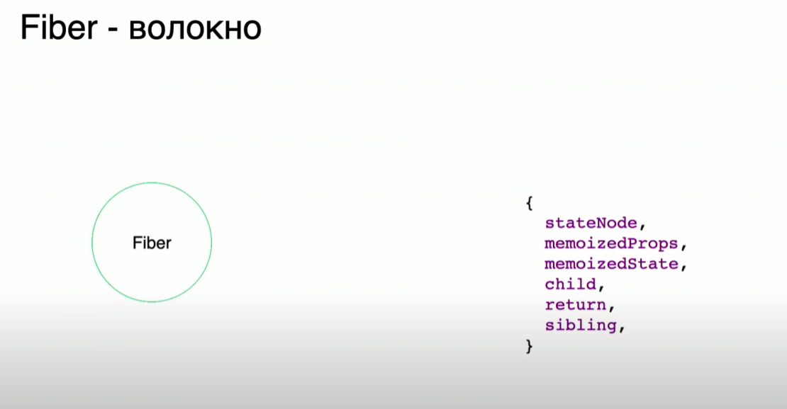
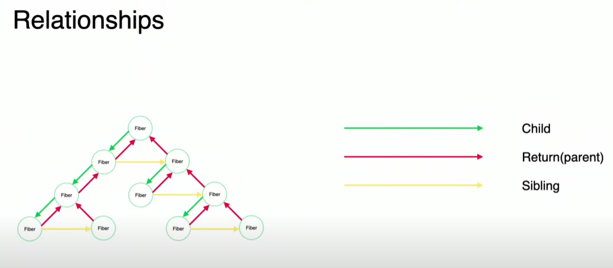
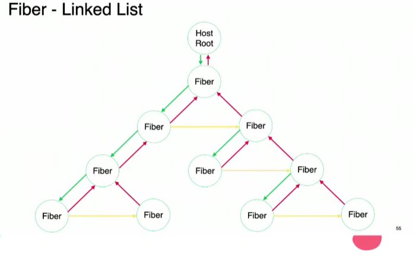

# **React**

## 1. **Что такое React?**

`React` — это JavaScript библиотека для создания пользовательских интерфейсов, разработанная Facebook в 2011. Она
позволяет разработчикам строить
интерфейсы, разделяя их на компоненты и упрощая управление состоянием приложения.

### Особенности React:

1. **`Компонентный подход`**: React основан на создании компонентов, которые можно переиспользовать. Компоненты
   позволяют разбить интерфейс на логически независимые части, каждая из которых отвечает за отдельную часть UI.

2. **`Однонаправленный поток данных`**: В React данные передаются сверху вниз (от родительских компонентов к дочерним)
   через `props`. Это делает поток данных предсказуемым и более контролируемым.

3. **`React Fiber`**: Это переработанная архитектура механизма рендеринга, которая оптимизирует процесс рендеринга.
   Fiber позволяет разбивать обновления на небольшие части и выполнять их асинхронно, что повышает отзывчивость
   пользовательского интерфейса, особенно при сложных анимациях и долгих вычислениях.

4. **`Реактивные обновления UI`**: React автоматически обновляет UI при изменении состояния (`state`). Это происходит
   благодаря механизму сравнения (reconciliation), который определяет, какие части UI нужно обновить.

5. **`JSX (JavaScript XML)`**: React использует JSX — синтаксический сахар, который позволяет писать HTML-подобный код
   внутри JavaScript. Это делает код более читаемым и удобным для разработчиков.

6. **`Поддержка хуков`**: Хуки (`Hooks`) — это функции, которые позволяют использовать состояние и другие возможности
   React в функциональных компонентах. Например, `useState` для состояния, `useEffect` для побочных эффектов и т.д.

7. **`Концепция декларативного UI`**: В React ты описываешь, что должно быть отображено в зависимости от определенного
   состояния, вместо того чтобы указывать, как изменять интерфейс шаг за шагом.

8. **`Экосистема и сообщество`**: React обладает огромной экосистемой библиотек и инструментов, включая React Router для
   маршрутизации, Redux для управления состоянием и многое другое. Большое сообщество способствует быстрому росту и
   поддержке.

## 2. **Техники оптимизации перфоманса React?**

### 1. **Использование `React.memo`**

Компонент, обернутый в `React.memo`, ререндерится только тогда, когда изменяются его пропсы. Это особенно полезно для
функциональных компонентов, которые не должны обновляться без необходимости.

   ```jsx
   const MyComponent = React.memo((props) => {
    // component logic
});
   ```

### 2. **Использование `useMemo` и `useCallback`**

- **`useMemo`**: Позволяет мемоизировать вычисления, чтобы их не выполнять при каждом рендере, если входные данные не
  изменились.
- **`useCallback`**: Мемоизирует функции, чтобы они не пересоздавались на каждом рендере.

   ```jsx
   const memoizedValue = useMemo(() => computeExpensiveValue(a, b), [a, b]);
const memoizedCallback = useCallback(() => {
    doSomething(a);
}, [a]);
   ```

### 3. **Ленивая загрузка компонентов (`React.lazy` и `Suspense`)**

Разделение кода позволяет загружать только те компоненты, которые нужны пользователю в данный момент, что уменьшает
время загрузки приложения.

   ```jsx
   const LazyComponent = React.lazy(() => import('./LazyComponent'));

function App() {
    return (
        <Suspense fallback={<div>Loading...</div>}>
            <LazyComponent/>
        </Suspense>
    );
}
   ```

### 4. **Оптимизация ререндеров с помощью `shouldComponentUpdate` или `PureComponent`**

В классовых компонентах можно использовать `shouldComponentUpdate` для управления обновлением компонента.
`PureComponent` делает это автоматически, сравнивая пропсы и состояние поверхностно.

   ```jsx
   class MyComponent extends React.PureComponent {
    render() {
        return <div>{this.props.name}</div>;
    }
}
   ```

### 5. **Оптимизация списков с `key`**

Всегда правильно устанавливайте уникальные ключи (`key`) для элементов списков. Это помогает React эффективно обновлять
и перерисовывать элементы.

   ```jsx
   const listItems = items.map((item) => <li key={item.id}>{item.name}</li>);
   ```

### 6. **Кэширование состояний и данных**

Используйте кэширование для часто используемых данных, чтобы не делать повторные запросы или пересчеты. Это можно делать
на уровне глобального состояния с помощью Redux Toolkit, `useReducer` или кэширования данных, например, через
`React Query`.

### 7. **Code-splitting с помощью Webpack или Vite**

Используйте инструменты для разделения кода и динамической загрузки, чтобы уменьшить начальный объем JavaScript, который
загружается при первой загрузке приложения.

### 8. **Профилирование и анализ производительности**

Используйте встроенные инструменты React Developer Tools для профилирования рендеров компонентов и поиска "узких мест" в
производительности. Это поможет вам найти компоненты, которые ререндерятся чаще, чем нужно.

### 9. **Избегание анонимных функций в JSX**

Анонимные функции и объекты, передаваемые в JSX, создаются заново при каждом рендере, что может привести к ненужным
ререндерам дочерних компонентов.

Вместо:

   ```jsx
   <button onClick={() => handleClick(item.id)}>Click me</button>
   ```

Лучше:

   ```jsx
   const handleClick = useCallback(() => {
    // logic
}, [item.id]);

<button onClick={handleClick}>Click me</button>
   ```

### 10. **Бандлы и Tree Shaking**

Оптимизируйте сборку с помощью таких техник, как **Tree Shaking**, чтобы исключить неиспользуемый код. Для этого нужно
правильно настраивать Webpack или Vite.

- избавиться от причин лишних ререндеров
- вынести тяжелые вычисления в отдельный поток (Web Workers)
- использовать useMemo, useCallback, React.memo для мемоизации вычислений
- избавиться от утечек памяти
- использовать атрибут key в списках
- кэшировать негорячие вычисления
- кэшировать ответы запросов сервера на N минут/секунд (применимо не всегда)
- и так далее

## 3. **Лучшие практики безопасности в React?**

В React, как и в любом другом веб-приложении, важно соблюдать лучшие практики безопасности для защиты данных и
предотвращения атак. Вот основные рекомендации:

### 1. **Защита от XSS (Cross-Site Scripting)**

- **Неиспользование `dangerouslySetInnerHTML`:** По возможности избегай использования этого метода, так как он может
  привести к внедрению вредоносного кода. Если его нужно использовать, убедись, что все данные проходят очистку.
- **Очистка входных данных:** Все данные, полученные от пользователя или внешних источников, должны быть проверены и
  очищены перед рендерингом в DOM. Можно использовать библиотеки, такие как `DOMPurify`, для очистки HTML.

### 2. **Защита от CSRF (Cross-Site Request Forgery)**

- **Использование токенов CSRF:** Реализуй CSRF-защиту на сервере и отправляй соответствующие токены с каждым запросом,
  требующим аутентификации. Эти токены можно передавать через заголовки или скрытые поля формы.
- **Запросы с проверкой источника:** Оценивай заголовки `Origin` и `Referer`, чтобы убедиться, что запросы поступают с
  доверенных доменов.

### 3. **Использование HTTP-only и Secure cookies**

- **HTTP-only Cookies:** Для аутентификации предпочтительно использовать куки с атрибутом `HttpOnly`, чтобы они не были
  доступны через JavaScript. Это защищает их от кражи с помощью XSS.
- **Secure Cookies:** Добавляй атрибут `Secure` к куки, чтобы они передавались только по защищенному соединению (HTTPS).

### 4. **Безопасная работа с API**

- **Не хранить чувствительные данные в клиенте:** Избегай хранения ключей API, токенов и других чувствительных данных в
  коде фронтенда. Используй прокси на сервере или защищенные переменные окружения для передачи таких данных.
- **Валидация на стороне сервера:** Всегда проверяй данные на стороне сервера, даже если они уже были проверены на
  клиенте. Это помогает избежать подделки данных на уровне клиентской стороны.

### 5. **Использование библиотек безопасности**

- **Helmet:** Используй библиотеки, такие как `helmet`, чтобы добавить HTTP-заголовки безопасности и предотвратить
  атаки. Например, `Content-Security-Policy` (CSP) помогает контролировать источники ресурсов и предотвратить XSS-атаки.
- **CSP (Content Security Policy):** Настрой политику безопасности контента для предотвращения загрузки
  несанкционированных скриптов и стилей.

### 6. **Ограничение доступов и управление сессиями**

- **Токены аутентификации:** Используй JWT или другие методы токенов для управления сессиями и проверкой прав
  пользователя.
- **Ограничение прав доступа:** Убедись, что пользователи с разными уровнями прав доступа имеют ограничения на
  выполнение определенных действий в приложении.

### 7. **Обновление зависимостей**

- **Регулярные обновления библиотек:** Убедись, что все зависимости, используемые в проекте (например, React, Axios),
  регулярно обновляются до последних безопасных версий. Это помогает предотвратить уязвимости, которые могут быть
  выявлены в старых версиях.
- **Использование инструментов для проверки безопасности:** Используй такие инструменты, как `npm audit` или аналогичные
  для Yarn, чтобы отслеживать потенциальные уязвимости в зависимостях.

### 8. **Управление ошибками**

- **Логирование ошибок:** Логи должны быть безопасными и не содержать конфиденциальной информации, такой как данные
  пользователей или ошибки аутентификации.
- **Защита от раскрытия информации:** Никогда не выводи детали об ошибках (например, стек-трейс) на клиенте, так как это
  может предоставить злоумышленникам важную информацию о внутренней структуре приложения.

### 9. **Шифрование данных**

- **Шифрование данных в полете:** Убедись, что все данные передаются по защищенным каналам (HTTPS). Это предотвращает
  атаки, такие как перехват данных (Man-in-the-Middle).
- **Шифрование данных на сервере:** Храни все чувствительные данные в зашифрованном виде на сервере.

### 10. **Аутентификация и авторизация**

- **OAuth 2.0 и OpenID Connect:** Для безопасной аутентификации и авторизации рекомендуется использовать стандарты,
  такие как OAuth 2.0 и OpenID Connect, в случае работы с внешними API или службами.
- **Тайм-ауты сессий:** Настрой разумные тайм-ауты для сессий пользователя, чтобы снизить риск компрометации аккаунта.

## 4. **React Fiber?**

[Объяснение - React (продвинутый)](https://www.youtube.com/watch?v=HDajDASxn-w)

### React Fiber — это механизм рендеринга в React, представленный в версии 16.

#### 2 фазы:

1. **Rendering and Reconciliation**
2. **Commit**

### Принцип работы React Fiber:

#### Фаза 1. Rendering and Reconciliation

1. Впервые создаётся дерево React-элементов.

2. Для каждого элемента создаётся Fiber Node, которая содержит информацию об этом элементе и хранит на него ссылку.
    - Элемент может пересоздаваться, но Fiber остаётся тем же, изменяется лишь ссылка (в течение всего жизненного цикла
      компонента существует один и тот же Fiber, который отслеживает состояние элемента между перерендерингами).
        - При маунте создаётся новый Fiber.
        - При апдейте Fiber не изменяется, а просто получает новую ссылку на элемент.
        - При удалении элемента Fiber также уничтожается.

3. Что представляет собой Fiber Node:

   

4. Дерево Fiber на самом деле является связанным списком (Linked List), а не обычным деревом.

   

    - Родительская нода связана только с одной дочерней нодой (даже если их несколько).
    - Каждый дочерний Fiber знает о своём родителе.
    - Дочерние ноды также связаны между собой (нода, о которой знает родитель, знает о своей соседней дочерней ноде, и
      так далее).

5. Связанный список Fiber начинается с Host Root ноды.

   

6. **Работа = эффекты** — это такие задачи, как запросы данных, подписки и изменения в DOM.

   Эффекты имеют разные приоритеты, и приоритизированные эффекты переходят на вторую фазу — фазу Commit.

**Приоритетность эффектов:**

- Высокий приоритет — визуальные изменения (useLayoutEffect), которые должны быть выполнены сразу.
- Обычный приоритет — обновления состояния и эффекты, влияющие на UI (useEffect).
- Низкий приоритет — фоновые задачи, такие как предварительная загрузка данных.
- Блокирующий приоритет — эффекты, связанные с вводом пользователя.

7. При обновлениях существует текущее дерево `Current Tree`. Нода, в которой произошли изменения, помечается как
   изменённая. Строится новое дерево `Work-in-Progress Tree`. React начинает поочерёдно клонировать элементы, которые не
   изменились.
    - React проходит от Host Root ноды и спускается вниз по дереву к самой глубокой дочерней ноде. Если у неё нет
      работы, React поднимается выше и проверяет, есть ли работа у её родительской ноды и соседних дочерних нод. Если
      работа есть, она выполняется.

   После этого React возвращается к Host Root ноде, собирает список работы, приоритизирует эффекты и применяет изменения
   к реальному DOM. После этого дерево `Work-in-Progress Tree` становится новым `Current Tree`.

8. React может приостанавливать и отменять процесс рендеринга и reconciliation, сохраняя текущее состояние в ноде
   `Next Unit of Work`. Это позволяет React продолжать работу с того места, где он остановился, когда станет больше
   свободных ресурсов.

9. **requestIdleCallback** — это метод браузера, который позволяет запускать функции в моменты простоя основного потока.
   React использует его для выполнения фоновых задач, не блокируя интерфейс пользователя.

#### Эвристики:

- Элементы разных типов создают разные деревья.
- Использование ключей (`key`) помогает React отслеживать стабильные элементы между рендерами, что ускоряет процесс
  сравнения.

#### Фаза 2. Commit

Эта фаза не может быть прервана.

В этой фазе React применяет все приоритизированные эффекты, собранные на первой фазе. Эти эффекты уже нельзя отменить, и
они обязательно должны быть отображены.

- Все изменения в DOM происходят до остальных эффектов.

1. Вносятся изменения в DOM.
2. Запускаются остальные эффекты, такие как `componentDidMount`, `componentDidUpdate` и подписки.

## 7. **Хуки?**

`Хуки` – это функции, с помощью которых можно «прицепиться» к состоянию и методам жизненного цикла React из
функциональных компонентов.

### **`Примеры хуков:`**

1. **`useState`**

Хук `useState()` предназначен для управления состоянием компонента. Эта функция возвращает массив с двумя элементами:
текущее значение состояния и функцию для его обновления. Сигнатура следующая:

```javascript
const [value, setValue] = useState(defaultValue);
```

**Использование предыдущего значения**: Если новое состояние зависит от предыдущего, вы можете передать функцию в
`setValue`:

```javascript
setValue(prevValue => prevValue + 1);
```

Пример использования:

```javascript
import React, {useState} from 'react';

function Counter() {
    const [count, setCount] = useState(0);

    return (
        <div>
            <p>Счетчик: {count}</p>
            <button onClick={() => setCount(count + 1)}>Увеличить</button>
        </div>
    );
}
```

---

2. **`useEffect`**

Хук `useEffect()` предназначен для запуска побочных эффектов (например, выполнения сетевого запроса или добавления
обработчика событий) после монтирования и отрисовки компонента. Эта функция принимает колбек и массив зависимостей.
Логика массива зависимостей следующая:

- **Не указан**: эффект запускается при каждом рендеринге.
- **Пустой массив**: эффект запускается только один раз.
- **С массивом элементов**: эффект запускается при изменении любого элемента.

**Очистка эффектов**: для очистки эффектов вы можете вернуть функцию из колбека:

```javascript
useEffect(() => {
    const timer = setTimeout(() => {
        console.log('Таймер сработал');
    }, 1000);

    return () => clearTimeout(timer); // Очистка таймера
}, []);
```

Пример использования:

```javascript
import React, {useEffect, useState} from 'react';

function Timer() {
    const [time, setTime] = useState(0);

    useEffect(() => {
        const timer = setInterval(() => {
            setTime(prevTime => prevTime + 1);
        }, 1000);

        return () => clearInterval(timer); // Очистка при размонтировании
    }, []);

    return <div>Время: {time} секунд</div>;
}
```

---

3. **`useLayoutEffect`**

Хук `useLayoutEffect()` похож на `useEffect()`, но запускает эффект **перед отрисовкой** компонента. Этот хук
предназначен для эффектов, которые влияют на внешний вид DOM, незаметно для пользователя.

Пример использования:

```javascript
import React, {useLayoutEffect, useRef} from 'react';

function LayoutExample() {
    const divRef = useRef();

    useLayoutEffect(() => {
        divRef.current.style.color = 'red'; // Стилизация элемента перед отрисовкой
    }, []);

    return <div ref={divRef}>Этот текст станет красным</div>;
}
```

---

4. **`useContext`**

Хук `useContext()` предназначен для прямой передачи пропсов компонентам, находящимся на любом уровне вложенности,
избегая "бурения пропсов" (prop drilling).

Пример использования:

```javascript
import React, {createContext, useContext} from 'react';

const ThemeContext = createContext('light');

function ThemedComponent() {
    const theme = useContext(ThemeContext);
    return <div className={theme}>Тема: {theme}</div>;
}

function App() {
    return (
        <ThemeContext.Provider value="dark">
            <ThemedComponent/>
        </ThemeContext.Provider>
    );
}
```

---

5. **`useReducer`**

Хук `useReducer()` предназначен для управления состоянием, особенно когда логика управления состоянием сложна или
зависит от предыдущего состояния. Он принимает редуктор (reducer), который обновляет состояние на основе типа (type) и,
опционально, полезной нагрузки (payload).

Пример использования:

```javascript
import React, {useReducer} from 'react';

const initialState = {count: 0};

function reducer(state, action) {
    switch (action.type) {
        case 'increment':
            return {count: state.count + 1};
        case 'decrement':
            return {count: state.count - 1};
        default:
            throw new Error();
    }
}

function Counter() {
    const [state, dispatch] = useReducer(reducer, initialState);

    return (
        <>
            Count: {state.count}
            <button onClick={() => dispatch({type: 'increment'})}>Увеличить</button>
            <button onClick={() => dispatch({type: 'decrement'})}>Уменьшить</button>
        </>
    );
}
```

---

6. **`useCallback`**

Хук `useCallback()` возвращает мемоизированную версию переданной функции обратного вызова. Он принимает колбек и массив
зависимостей. Колбек пересоздаётся только при изменении значений одной из зависимостей.

Пример использования:

```javascript
import React, {useCallback, useState} from 'react';

function Button({onClick}) {
    console.log('Кнопка перерисована');
    return <button onClick={onClick}>Нажми меня</button>;
}

function App() {
    const [count, setCount] = useState(0);

    const handleClick = useCallback(() => {
        setCount(count + 1);
    }, [count]);

    return (
        <>
            <Button onClick={handleClick}/>
            <p>Счетчик: {count}</p>
        </>
    );
}
```

---

7. **`useMemo`**

Хук `useMemo()` мемоизирует значение, которое вычисляется на основе зависимостей. Он полезен для оптимизации
производительности, если вычисление значения дорогостоящее.

Пример использования:

```javascript
import React, {useMemo, useState} from 'react';

function App() {
    const [count, setCount] = useState(0);

    const expensiveValue = useMemo(() => {
        // Дорогостоящее вычисление
        return count * 2;
    }, [count]);

    return (
        <>
            <p>Счетчик: {count}</p>
            <p>Дорогостоящее значение: {expensiveValue}</p>
            <button onClick={() => setCount(count + 1)}>Увеличить</button>
        </>
    );
}
```

---

8. **`useRef`**

Хук `useRef()` возвращает объект, свойство `current` которого содержит ссылку на узел DOM. Он также может использоваться
для сохранения любого мутирующего значения, которое не вызывает повторный рендеринг при изменении.

Создание ссылки:

```javascript
const node = useRef();
```

Добавление ссылки к элементу:

```javascript
<tagName ref={node}></tagName>
```

Пример использования:

```javascript
import React, {useRef} from 'react';

function FocusInput() {
    const inputRef = useRef();

    const focusInput = () => {
        inputRef.current.focus();
    };

    return (
        <>
            <input ref={inputRef} type="text"/>
            <button onClick={focusInput}>Фокус на поле ввода</button>
        </>
    );
}
```

---

### **`Правила создания пользовательского хука:`**

- Название хука должно начинаться с use.
- Следует использовать сначала встроенные хуки, если они решают нужную задачу, прежде чем создавать свои.
- Нельзя вызывать хук условно. Хук надо вызывать тогда, когда это необходимо.
- В хуке должна быть только логика, которую можно использовать повторно. Не стоит добавлять в него код, который нужен
  только в одном месте.
- Хук должен быть чистой функцией.
- Хук может возвращать значение или вызывать другие хуки. Это позволяет создавать цепочки обработки данных.
- Название хука должно быть понятным и отражать его назначение. Это поможет другим разработчикам понять, что делает этот
  хук и как его можно использовать.

## 8. **Что Такое JSX?**

`JSX (JavaScript XML)` — это синтаксический сахар для описания структуры UI в JavaScript, который позволяет писать
HTML-подобный код внутри JavaScript-файлов.

## 9. **Для чего нужен атрибут key при рендере списков?**

`Атрибут key` используется React для идентификации элементов в списке. Это помогает React более эффективно обновлять и
перерисовывать только измененные элементы списка, минимизируя затраты на рендеринг.

## 10. **Что такое Компонент высшего порядка (Higher-Order Component/HOC)?**

`Компонент высшего порядка (Higher-Order Component, HOC)` — это паттерн, который позволяет повторно использовать
логику между разными компонентами. HOC представляет собой функцию, которая принимает компонент и возвращает новый
компонент с добавленной функциональностью.

Основная идея HOC заключается в том, чтобы «оборачивать» компоненты для добавления им дополнительных свойств или логики
без изменения исходного компонента. Это особенно полезно для повторного использования кода, управления состоянием,
работы с побочными эффектами и т. д.

Пример использования:

```jsx
// Функция HOC
const withLogging = (WrappedComponent) => {
    return (props) => {
        console.log('Props:', props);
        return <WrappedComponent {...props} />;
    };
};

// Компонент, который мы оборачиваем
const MyComponent = ({message}) => {
    return <div>{message}</div>;
};

// Использование HOC для оборачивания компонента
const MyComponentWithLogging = withLogging(MyComponent);

// В рендере
<MyComponentWithLogging message="Hello, HOC!"/>
```

В этом примере `withLogging` — это HOC, который оборачивает `MyComponent`, добавляя вывод логов для всех пропсов,
переданных в компонент.

Важно отметить, что HOC не изменяет или не мутирует оригинальный компонент; он создает новый компонент с добавленными
возможностями.

## 11. **Разница между управляемыми (controlled) и не управляемыми (uncontrolled) компонентами?**

### **`Управляемые компоненты (Controlled Components):`**

Состояние компонента хранится в родительском компоненте, и все изменения в состоянии контролируются через props.
Например, значения полей формы передаются через props, и их обновление происходит через обработчики событий.

Пример:

```jsx
function ControlledInput() {
    const [inputValue, setInputValue] = useState('');

    const handleChange = (e) => {
        setInputValue(e.target.value);
    };

    return (
        <input
            type="text"
            value={inputValue}
            onChange={handleChange}
        />
    );
}
```

- Состояние (`inputValue`) полностью контролируется React-компонентом.
- Любые изменения происходят через обновление состояния компонента, что делает его предсказуемым и синхронизированным с
  React.

### **`Неуправляемые компоненты (Uncontrolled Components):`**

Состояние компонента хранится внутри самого компонента, и управление им осуществляется через рефы (refs). Это значит,
что компоненты не требуют обработки значений через состояние родителя.

Пример:

```jsx
function UncontrolledInput() {
    const inputRef = useRef(null);

    const handleSubmit = () => {
        console.log(inputRef.current.value);
    };

    return (
        <>
            <input type="text" ref={inputRef}/>
            <button onClick={handleSubmit}>Submit</button>
        </>
    );
}
```

- Состояние инпута здесь не контролируется React, а доступ к значению происходит через прямой доступ к DOM.
- Такие компоненты могут быть полезны, если нет необходимости в частом обновлении состояния.

## 12. **Стадии жизненного цикла компонента в React?**

В React жизненный цикл компонента включает несколько стадий, которые можно разделить на три основные фазы:
`монтирование`, `обновление` и `размонтирование`. Каждая из них имеет свои методы жизненного цикла, которые вызываются в
определённые моменты.

### 1. **`Монтирование (Mounting)`**

Это фаза, когда компонент создаётся и вставляется в DOM.

- **`constructor(props)`** — вызывается перед монтированием компонента, используется для инициализации состояния и
  привязки методов.
- **`static getDerivedStateFromProps(props, state)`** — вызывается перед каждым рендером, в том числе и на стадии
  монтирования. Используется для синхронизации состояния с изменениями в props.
- **`render()`** — единственный обязательный метод. Возвращает JSX, который описывает UI компонента.
- **`componentDidMount()`** — вызывается сразу после монтирования компонента в DOM. Здесь обычно выполняются побочные
  эффекты (например, запросы к API).

### 2. **`Обновление (Updating)`**

Происходит при изменении props или состояния компонента.

- **`static getDerivedStateFromProps(props, state)`** — вызывается перед каждым рендером при обновлении.
- **`shouldComponentUpdate(nextProps, nextState)`** — позволяет предотвратить перерисовку компонента. Возвращает
  `true` (по умолчанию) или `false`.
- **`render()`** — перерисовывает компонент на основе новых данных.
- **`getSnapshotBeforeUpdate(prevProps, prevState)`** — вызывается перед обновлением в DOM и может использоваться для
  получения данных до самого обновления (например, позиция прокрутки).
- **`componentDidUpdate(prevProps, prevState, snapshot)`** — вызывается после обновления компонента в DOM. Здесь можно
  совершить действия на основе изменений.

### 3. **`Размонтирование (Unmounting)`**

Когда компонент удаляется из DOM.

- **`componentWillUnmount()`** — вызывается перед размонтированием компонента. Используется для очистки ресурсов (
  таймеров, подписок и т.д.).

### **`Дополнительные методы (стадия обработки ошибок):`**

- **`componentDidCatch(error, info)`** — используется для обработки ошибок, возникших в процессе рендеринга дочерних
  компонентов.
- **`static getDerivedStateFromError(error)`** — вызывается при возникновении ошибки в компоненте. Позволяет обновить
  состояние на основе ошибки.

## 13. **Методы жизненного цикла компонента в React?**

`Методы жизненного цикла компонента` позволяют управлять поведением компонента на разных этапах его существования:

1. **`constructor(props)`**:
    - Вызывается перед монтированием компонента.
    - Используется для инициализации состояния и привязки методов.

2. **`componentDidMount()`**:
    - Вызывается сразу после того, как компонент был смонтирован.
    - Отличное место для выполнения запросов к API и добавления подписок.

3. **`componentDidUpdate(prevProps, prevState)`**:
    - Вызывается после обновления компонента.
    - Используется для выполнения действий на основе изменений в пропсах или состоянии.

4. **`componentWillUnmount()`**:
    - Вызывается перед размонтированием компонента.
    - Полезен для очистки подписок или таймеров.

5. **`shouldComponentUpdate(nextProps, nextState)`**:
    - Позволяет оптимизировать производительность, позволяя вам контролировать, нужно ли перерисовывать компонент.
    - Возвращает `true` или `false`.

6. **`getDerivedStateFromProps(nextProps, prevState)`**:
    - Вызывается перед рендерингом, как при монтировании, так и при обновлении.
    - Используется для обновления состояния на основе изменений в пропсах.

7. **`getSnapshotBeforeUpdate(prevProps, prevState)`**:
    - Вызывается прямо перед обновлением DOM.
    - Позволяет захватить информацию (например, позицию прокрутки), которая может быть полезна в `componentDidUpdate`.

8. **`componentDidCatch(error, info)`**:
    - Вызывается, когда происходит ошибка в любом дочернем компоненте.
    - Позволяет обрабатывать ошибки и показывать запасной интерфейс.

## 14. **Что такое портал (Portal)?**

`Портал (Portal)` — это особый способ рендеринга дочерних компонентов в DOM-узле, который находится вне иерархии
родительского компонента. Это полезно в случаях, когда нужно отобразить компонент, например, модальное окно или
всплывающее меню, над другими компонентами, не нарушая их структуру.

### **`Основные особенности порталов:`**

1. **`Отдельный DOM-узел`**: Компонент, использующий портал, будет отрисован в указанном узле, но всё еще будет частью
   иерархии компонентов React. Это значит, что он может продолжать получать контекст и события от родительских
   компонентов.

2. **`Создание портала`**: Для создания портала в React используется метод `ReactDOM.createPortal()`, который принимает
   два аргумента:
    - `children`: дочерние компоненты, которые вы хотите отобразить.
    - `container`: DOM-узел, в который будут отрисованы дочерние компоненты.

Пример использования:

```jsx
import React from 'react';
import ReactDOM from 'react-dom';

const Modal = ({children}) => {
    return ReactDOM.createPortal(
        <div className="modal">
            {children}
        </div>,
        document.getElementById('modal-root') // укажите здесь нужный контейнер
    );
};

const App = () => {
    return (
        <div>
            <h1>Приложение</h1>
            <Modal>
                <h2>Это модальное окно!</h2>
            </Modal>
        </div>
    );
};

export default App;
```

### **`Когда использовать порталы:`**

- Для создания модальных окон, всплывающих уведомлений, тултипов и других компонентов, которые должны визуально "
  выходить" за пределы родительских контейнеров.
- Когда нужно избежать проблем с CSS-стилями:

**`Избежание overflow:`** Если родительский контейнер имеет стиль overflow: hidden, overflow: auto или overflow: scroll,
дочерние компоненты, рендерящиеся внутри этого контейнера, могут быть обрезаны или не отображаться полностью. Порталы
позволяют избежать этой проблемы, помещая модальные окна или всплывающие элементы в другой контейнер, который не
ограничен стилями родительского элемента.

**`Позиционирование:`** При использовании абсолютного или фиксированного позиционирования (например, position: absolute,
position: fixed) дочерние компоненты могут неправильно позиционироваться относительно родителя. Порталы могут помочь,
позволяя элементам позиционироваться относительно корневого DOM-узла, а не родительского компонента.

**`Проблемы со слоями:`**Если у вас есть несколько компонентов, которые накладываются друг на друга, порталы могут
помочь избежать проблем с z-индексом, позволяя вам управлять порядком отображения компонентов, независимо от их места в
иерархии компонентов.

**`Упрощение управления стилями:`** При использовании порталов вы можете применить стили к модальным окнам и другим
всплывающим элементам без влияния на другие компоненты в родительской иерархии, что упрощает управление стилями и их
переиспользование.

## 15. **Что такое контекст (Context)?**

`В React контекст (Context)` — это способ передавать данные через дерево компонентов, минуя промежуточные компоненты.
Это
полезно, когда некоторые данные или функции должны быть доступны многим компонентам на разных уровнях дерева, но
передача их через пропсы на каждом уровне может быть трудоемкой и неэффективной.

### **`Основные элементы контекста:`**

1. **`Создание контекста:`** Используйте `React.createContext` для создания контекста. Это возвращает объект с двумя
   компонентами: `Provider` и `Consumer`.

    ```jsx
    const MyContext = React.createContext(defaultValue);
    ```

2. **`Provider:`** Компонент `Provider` предоставляет данные контекста для всех дочерних компонентов. Он принимает
   проп `value`, который будет доступен для всех потребителей контекста.

    ```jsx
    <MyContext.Provider value={/* значение контекста */}>
      {/* дочерние компоненты */}
    </MyContext.Provider>
    ```

3. **`Consumer:`** Компонент `Consumer` позволяет компонентам получать данные из контекста. С помощью функции как
   ребенка (render prop) вы можете получить доступ к данным контекста.

    ```jsx
    <MyContext.Consumer>
      {/*{value =>  использование значения контекста }*/}
    </MyContext.Consumer>
    ```

4. **`useContext:`** С React 16.8 и выше можно использовать хук `useContext` для доступа к контексту в функциональных
   компонентах.

    ```jsx
    const value = useContext(MyContext);
    ```

Пример использования:

```jsx
// Создание контекста
const LanguageContext = React.createContext('en');

// Компонент Provider
const LanguageProvider = ({children}) => {
    const [language, setLanguage] = React.useState('en');

    return (
        <LanguageContext.Provider value={{language, setLanguage}}>
            {children}
        </LanguageContext.Provider>
    );
};

// Компонент Consumer
const Greeting = () => {
    const {language} = React.useContext(LanguageContext);

    return <h1>{language === 'en' ? 'Hello!' : '¡Hola!'}</h1>;
};

// Использование
const App = () => (
    <LanguageProvider>
        <Greeting/>
    </LanguageProvider>
);
```

### **`Проблема Context`**

**`Проблема контекста проста:`** все, что использует контекст, перерендеривается каждый раз, когда контекст изменяет
состояние.

Это означает, что если вы используете свой контекст повсеместно в своем приложении или, что еще хуже, используете один
контекст для состояния всего приложения, то вы вызываете тонну повторных ререндерингов повсюду!

**`Что насчет мемоизации (запоминания) ?`**
Может мы просто забыли использовать useMemo как объяснил Kent. Давайте попробуем замемоизировать наш контекст и
посмотрим, что произошло -> Неа, мемоизация с useMemo нам не помогла вообще...

**`Что настет компонентов, которые не запрашивают context? Они перерендериваются?`**
Ну, это пока единственная хорошая новость. **Только компоненты, которые вызывают useContext, повторно ререндерятся при
изменении стейта контекста.**

Источник - https://dev.to/balaevarif/react-context-api-3h01

## 16. **Разница между состоянием(state) и пропсами(props)?**

### **`Свойство (props):`**

- **Передача данных**: `props` (свойства) передаются в компонент извне, то есть родительский компонент передает
  данные дочернему компоненту.
- **Неизменяемость**: Компонент не должен изменять свои `props`. Если нужно изменить данные, их нужно передать снова
  от родительского компонента.
- **Использование**: Используются для настройки компонента и передачи данных от родителя к ребенку.

### **`Состояние (state):`**

- **Локальное состояние**: `state` — это локальное состояние компонента, которое управляется самим компонентом.
  Компонент может изменять свое состояние с помощью функции обновления состояния.
- **Изменяемость**: Компонент может изменять свое состояние, что приводит к перерисовке компонента с новыми данными.
- **Использование**: Используется для хранения и управления данными, которые могут изменяться в процессе работы
  компонента.

Пример:

```jsx
// Родительский компонент
function ParentComponent() {
    const [value, setValue] = useState('Hello');

    return <ChildComponent value={value} onChange={setValue}/>;
}

// Дочерний компонент
function ChildComponent({value, onChange}) {
    return (
        <div>
            <p>{value}</p>
            <button onClick={() => onChange('World')}>Change</button>
        </div>
    );
}
```

В этом примере `value` и `onChange` — это `props`, которые передаются из родительского компонента в
дочерний. `ChildComponent` использует их для отображения данных и обновления их при нажатии на кнопку.

## 17. **Что такое фрагмент (Fragment)?**

`Фрагмент (Fragment) в React` — это специальный элемент в React, позволяющий возвращать группу элементов без
помещения их в дополнительный DOM узел.

## 18. **Что такое синтетические события в React?**

`В React синтетические события` — это обертка над нативными событиями браузера. Они создаются React для обеспечения
кросс-браузерной совместимости и улучшения производительности. Вот несколько ключевых моментов о синтетических событиях:

1. **`Кросс-браузерная совместимость`**: Синтетические события предоставляют единый интерфейс для событий, который
   работает одинаково во всех поддерживаемых браузерах, избегая различий в реализации событий между браузерами.

2. **`Упрощение работы с событиями`**: Синтетические события обеспечивают такие же свойства и методы, как и нативные
   события, например, `event.target`, `event.currentTarget`, `event.preventDefault()`, и `event.stopPropagation()`.

3. **`Пул событий`**: React использует пул событий, чтобы уменьшить количество объектов событий, создаваемых при каждом
   событии. Это позволяет эффективно управлять памятью. После того как событие обработано, React возвращает его в пул,
   что означает, что доступ к свойствам события возможен только внутри обработчика.

4. **`Проброс событий`**: Синтетические события поддерживают концепцию проброса событий (event bubbling), то есть они
   проходят через цепочку элементов от целевого элемента до корня дерева.

Пример использования:

```jsx
function handleClick(event) {
    // Событие здесь будет синтетическим
    console.log(event.type); // 'click'
    console.log(event.target); // Целевой элемент
}

function App() {
    return (
        <button onClick={handleClick}>Click me</button>
    );
}
```

## 19. **Что такое React-ссылка (ref)? Как создать ссылку?**

`В React ref (или ссылка)` — это способ получить доступ к DOM-узлам, к которому она привязана.
Для создания ссылки в функциональном компоненте вы можете использовать хук `useRef`.

**`Ситуации, в которых использование рефов является оправданным:`**

- Управление фокусом
- Выделение текста
- Вызов scrollTo
- Вызов анимаций
- Интеграция со сторонними DOM-библиотеками

**`Важно:`**

- В рефах `можно хранить любое значение`, а не обязательно ссылку на элемент.

- Изменение поля ref.current `не приводит к реренденру компонента`.

- `Для передачи рефов через пропсы` требуется обернуть дочерний компонент в `forwardRef`

Создание компонента с использованием forwardRef:

```jsx
import React, {forwardRef} from 'react';

// Компонент Input, который принимает ref
const Input = forwardRef((props, ref) => {
    return <input ref={ref} {...props} />;
});

export default Input;

```

Использование компонента с переданным ref:

```jsx
import React, {useRef} from 'react';
import Input from './Input'; // Предполагаем, что Input находится в том же каталоге

const ParentComponent = () => {
    const inputRef = useRef(null);

    const focusInput = () => {
        inputRef.current.focus(); // Устанавливаем фокус на input
    };

    return (
        <div>
            <Input ref={inputRef} type="text" placeholder="Введите текст"/>
            <button onClick={focusInput}>Установить фокус</button>
        </div>
    );
};

export default ParentComponent;

```

## 20. **Что такое условный рендеринг (Conditional Rendering)?**

`Условный рендеринг` позволяет отображать компоненты или элементы в зависимости от условий. Это можно сделать с помощью
условных операторов (`if`, тернарный оператор) внутри метода рендера или функции.

## 21. **Разница между React и ReactDOM?**

**`React`**: Библиотека для создания компонентов и управления состоянием.

**`ReactDOM`**: Библиотека, которая отвечает за рендеринг React-компонентов в реальный DOM.

## 22. **Разница между элементом и компонентом?**

**`Элемент`**: Основной строительный блок React, описывающий, что отображается на экране. React-элементы иммутабельны.

```javascript
const element = <h1>Привет, мир</h1>;
```

**`Компонент`**: Функция или класс, возвращающий элемент или элементы для отображения. Может быть как чисто визуальным,
так и содержать логику.

## 23. **Разница между компонентом и контейнером?**

**`Компонент`**: Переиспользуемая часть UI, которая может быть как визуальным элементом, так и логическим элементом.

**`Контейнер`**: Компонент, который управляет состоянием и передачей данных другим компонентам. Часто служит для
управления состоянием и логикой.

## 24. **Что такое строгий режим в React? Его преимущества?**

`Строгий режим (<React.StrictMode>)` помогает выявлять потенциальные проблемы в приложении, такие как устаревшие API и
небезопасные методы. Он активирует дополнительные проверки и предупреждения в режиме разработки.

## 25. **Что такое «бурение пропсов» (Prop Drilling)? Как его избежать?**

`Бурение пропсов` — это процесс передачи данных от родительского компонента через несколько уровней дочерних
компонентов.
Это можно избежать, используя контекст или менеджер состояния.

## 26. **Что такое «опрос» (Polling)? Как его реализовать в React?**

`Опрос (Polling)` — это метод регулярного получения данных от сервера. Реализуется с помощью `setInterval` для
периодического вызова
API в компоненте и обновления состояния.

## 27. **Что такое сhildren?**

`children` — это специальный пропс, который используется для передачи вложенных элементов или компонентов в компонент.
Он позволяет создавать компоненты с гибкой структурой.

## 28. **Что такое инверсия наследования?**

`Инверсия наследования (или инверсия управления)` — это паттерн проектирования, который позволяет компонентам и другим
сущностям взаимодействовать друг с другом, не завися от конкретных реализаций. В контексте React это может быть связано
с передачей управления обработкой событий или состоянием от дочерних компонентов к родительским.

### **`Основные идеи инверсии наследования:`**

1. **`Контейнер и презентер`**:
    - Разделение логики (контейнер) и представления (презентер). Контейнеры управляют состоянием и поведением, в то
      время как презентеры фокусируются на визуализации данных.

2. **`Использование функций в качестве детей (Function as Children)`**:
    - Дочерние компоненты могут принимать функции как дочерние элементы. Это позволяет родительскому компоненту
      управлять тем, как и когда должны отображаться дочерние компоненты.

3. **`Состояние и события`**:
    - Вместо того чтобы позволять дочерним компонентам напрямую управлять состоянием, родительский компонент может
      передать функции для обновления состояния, которые дочерние компоненты могут вызывать.

Пример:

```jsx
const MyComponent = ({render}) => {
    const [count, setCount] = React.useState(0);

    const increment = () => setCount(count + 1);

    return render(count, increment);
};

const App = () => (
    <MyComponent
        render={(count, increment) => (
            <div>
                <p>Count: {count}</p>
                <button onClick={increment}>Increment</button>
            </div>
        )}
    />
);
```

## 29. **Как в React реализовать двустороннее связывание данных?**

`Двустороннее связывание данных (two-way data binding)` можно реализовать с помощью контролируемых компонентов.
Это процесс, когда изменения в интерфейсе пользователя (например, в форме) обновляют состояние компонента, и, наоборот,
изменения в состоянии компонента обновляют интерфейс.

### **`Шаги для реализации двустороннего связывания:`**

1. **`Создание состояния для хранения данных.`**
   Используйте хук `useState`, чтобы создать состояние для отслеживания данных в форме.

2. **`Привязка значения к элементу формы.`**
   Установите значение элемента формы (например, `input`) равным состоянию компонента.

3. **`Обработка изменений.`**
   Используйте обработчик событий (например, `onChange`), чтобы обновлять состояние при изменении значения элемента
   формы.

Пример:

```jsx
import React, {useState} from 'react';

function MyForm() {
    // Состояние для отслеживания значения инпута
    const [inputValue, setInputValue] = useState('');

    // Обработчик для обновления состояния при изменении инпута
    const handleInputChange = (event) => {
        setInputValue(event.target.value);
    };

    return (
        <div>
            {/* Привязка состояния к значению инпута и обработка изменений */}
            <input
                type="text"
                value={inputValue}
                onChange={handleInputChange}
            />
            <p>Вы ввели: {inputValue}</p>
        </div>
    );
}

export default MyForm;
```

### **`Как это работает:`**

1. Поле ввода получает значение из состояния `inputValue` через атрибут `value`.
2. Когда пользователь вводит текст, вызывается функция `handleInputChange`, которая обновляет состояние с
   помощью `setInputValue`.
3. Обновлённое состояние снова передаётся в компонент, что приводит к обновлению значения в элементе `input`.

## 30. **Разница между классовым и функциональным компонентами?**

**`Классовые компоненты`**: Используют классы для определения компонентов, поддерживают методы жизненного цикла и могут
использовать состояние.

**`Функциональные компоненты`**: Определяются как функции и могут использовать хуки для управления состоянием и
побочными эффектами.

## 31. **Что такое поднятие состояния вверх (Lifting State Up)?**

`Поднятие состояния вверх (Lifting State Up)` — это паттерн, который используется, когда нескольким компонентам
нужно делиться одним и тем же состоянием. Вместо того чтобы хранить состояние в каждом из этих компонентов отдельно,
состояние поднимается в ближайший общий родительский компонент, который может управлять им и передавать его как пропсы
дочерним компонентам.

Допустим, у нас есть два компонента, которые должны работать с одним и тем же состоянием, скажем, с состоянием `count`.
Один компонент должен отображать текущее значение, а другой — изменять его.

1. **`Дочерние компоненты`**:
    - Один компонент отображает значение.
    - Второй компонент изменяет его.

2. **`Поднятие состояния`**: Вместо того, чтобы оба компонента управляли своим состоянием независимо, состояние `count`
   хранится в родительском компоненте. Родитель передаёт его значение и функции для изменения состояния через пропсы
   дочерним компонентам.

```jsx
// Родительский компонент
function ParentComponent() {
    const [count, setCount] = useState(0);

    return (
        <div>
            <DisplayComponent count={count}/>
            <ChangeComponent setCount={setCount}/>
        </div>
    );
}

// Компонент для отображения значения
function DisplayComponent({count}) {
    return <div>Current count: {count}</div>;
}

// Компонент для изменения значения
function ChangeComponent({setCount}) {
    return <button onClick={() => setCount((prev) => prev + 1)}>Increment</button>;
}
```

В этом примере состояние `count` хранится в родительском компоненте `ParentComponent`, а его значение и функция для
изменения передаются дочерним компонентам `DisplayComponent` и `ChangeComponent` через пропсы.

## 32. **Разница между createElement() и cloneElement()?**

`createElement()` и `cloneElement()` — это методы из библиотеки React, но они выполняют разные функции:

1. **`createElement()`**:
    - Используется для создания нового элемента React.
    - Формат вызова: `React.createElement(type, props, ...children)`.
    - `type` — это тип элемента (например, строка для HTML-элемента или класс/функция для пользовательского компонента).
    - `props` — объект с атрибутами и свойствами элемента.
    - `children` — дочерние элементы, которые будут вложены в создаваемый элемент.

   Пример:
   ```jsx
   const element = React.createElement('div', { className: 'my-class' }, 'Hello, world!');
   ```

   Этот код создаст элемент `<div className="my-class">Hello, world!</div>`.

2. **`cloneElement()`**:
    - Используется для создания копии существующего элемента React с возможностью изменения его свойств.
    - Формат вызова: `React.cloneElement(element, [props], [...children])`.
    - `element` — это React-элемент, который вы хотите клонировать.
    - `props` — объект с новыми или измененными свойствами, которые вы хотите применить к клонированному элементу.
    - `children` — новые дочерние элементы, которые вы хотите добавить или заменить в клонированном элементе.

   Пример:
   ```jsx
   const element = <div className="my-class">Hello, world!</div>;
   const clonedElement = React.cloneElement(element, { className: 'new-class' });
   ```

В этом примере `clonedElement` будет `<div className="new-class">Hello, world!</div>`.

## 33. **Что такое распределенный компонент?**

`В React распределенный компонент (или "composed component")` — это компонент, который построен из нескольких других
компонентов. Такая структура позволяет разделять функциональность на более мелкие и переиспользуемые части. Это улучшает
организацию кода, облегчает его поддержку и тестирование.

Например, вместо создания одного большого компонента, который отвечает за всё, можно создать несколько меньших
компонентов и использовать их вместе:

```jsx
// Крупный компонент
const UserProfile = () => {
    return (
        <div>
            <UserAvatar/>
            <UserName/>
            <UserBio/>
        </div>
    );
};

// Меньшие компоненты
const UserAvatar = () => ;
const UserName = () => <h1>John Doe</h1>;
const UserBio = () => <p>This is a user bio.</p>;
```

Здесь `UserProfile` — это распределенный компонент, который использует `UserAvatar`, `UserName` и `UserBio` в своем
рендере. Такая структура упрощает работу с компонентами и делает их более гибкими.

Пример ленивой загрузки распределенного компонента:

```js
import React, {Suspense} from 'react';

const DistributedComponent = React.lazy(() => import('./DistributedComponent'));

function App() {
    return (
        <div>
            <Suspense fallback={<div>Loading...</div>}>
                <DistributedComponent/>
            </Suspense>
        </div>
    );
}

export default App;
```

### Преимущества распределенных компонентов:

- **Уменьшение дублирования кода**: Компонент используется в нескольких местах с разной конфигурацией.
- **Оптимизация производительности**: Компоненты загружаются только тогда, когда они действительно необходимы.
- **Упрощение управления состоянием**: Можно использовать контекст или другие подходы для передачи состояния между
  распределенными компонентами.

## 34. **Как отрендерить HTML код в React-компоненте?**

Можно использовать `dangerouslySetInnerHTML`, чтобы вставить HTML-код непосредственно в компонент. Это
позволяет вам рендерить HTML-код, который вы получили из внешнего источника или динамически сгенерировали. Однако, как
следует из названия, этот метод может представлять риски безопасности, такие как XSS-атаки, если HTML-код не был должным
образом очищен или проверен.

Вот пример использования `dangerouslySetInnerHTML`:

```jsx
import React from 'react';

const HtmlRenderer = ({html}) => {
    return (
        <div dangerouslySetInnerHTML={{__html: html}}/>
    );
};

export default HtmlRenderer;
```

В этом примере компонент `HtmlRenderer` принимает строку `html` в качестве пропса и вставляет её как HTML в `div`.
**`Убедитесь, что HTML-код, который вы вставляете, безопасен и не содержит потенциальных уязвимостей.`**

## 35. **Разница между memo и useMemo?**

`memo и useMemo` — это две разные вещи в React, которые служат для оптимизации производительности, но используются в
разных контекстах.

### **`React.memo:`**

- Это компонент высшего порядка (HOC), который предотвращает повторный рендеринг компонента, если его пропсы не
  изменились.
- Применяется к функциональным компонентам.
- Например:

```jsx
const MyComponent = React.memo((props) => {
// компонент рендерится только если props изменяются
    return <div>{props.value}</div>;
});
```

### **`useMemo:`**

- Это хук, который кэширует результат вычислений, чтобы избежать повторных вычислений при каждом рендеринге компонента.
- Полезен для оптимизации производительных вычислений или создания объектов и массивов, которые зависят от пропсов или
  состояния.
- Например:

```jsx
const MyComponent = ({items}) => {
    const processedItems = useMemo(() => {
// дорогая операция
        return items.map(item => item * 2);
    }, [items]); // зависимости

    return (
        <ul>
            {processedItems.map(item => <li key={item}>{item}</li>)}
        </ul>
    );
};
```

## 36. **Отличие useCallback от useMemo?**

### `useCallback`

- **`Назначение`**: Используется для мемоизации функции, чтобы избежать её пересоздания при каждом рендере компонента.
- **`Синтаксис`**: `const memoizedCallback = useCallback(() => { /* код */ }, [dependencies]);`
- **`Когда использовать`**: Полезен, когда вы передаёте функции как пропсы в дочерние компоненты и хотите избежать их
  пересоздания, что может привести к ненужным рендерам дочерних компонентов.

Пример:

  ```jsx
  const handleClick = useCallback(() => {
    console.log('Button clicked');
}, []);
  ```

### `useMemo`

- **`Назначение`**: Используется для мемоизации результата вычисления, чтобы избежать его пересчета при каждом рендере.
- **`Синтаксис`**: `const memoizedValue = useMemo(() => computeExpensiveValue(a, b), [dependencies]);`
- **`Когда использовать`**: Полезен, когда у вас есть дорогостоящие вычисления, которые не нужно пересчитывать, если
  зависимости не изменились.

Пример:

  ```jsx
  const computedValue = useMemo(() => {
    return a + b; // дорогая операция
}, [a, b]);
  ```

## 37. **Является ли React реактивным?**

`Да`, React является реактивной библиотекой.
В контексте разработки "реактивность" означает, что пользовательский интерфейс (UI) автоматически обновляется при
изменении данных.
Это достигается благодаря использованию состояния и жизненного цикла компонентов.

Когда состояние компонента изменяется, React автоматически перерисовывает этот компонент и его дочерние компоненты,
что позволяет разработчикам сосредоточиться на логике приложения, а не на управлении обновлением интерфейса.
Эта реактивная природа делает разработку более удобной и упрощает создание сложных интерфейсов.

## 38. **Что такое обратный поток данных в React?**

`Обратный поток данных (или обратный поток)` в React относится к ситуации, когда данные передаются от дочернего
компонента
к родительскому. В React данные обычно передаются от родительского компонента к дочернему через пропсы. Однако иногда
бывает нужно, чтобы дочерний компонент сообщал родительскому о каких-то изменениях или событиях. Это и есть обратный
поток данных.

Вот как это можно реализовать:

### 1. **`Объявление функции в родительском компоненте:`**

Родительский компонент определяет функцию, которая будет
обрабатывать изменения данных.

```jsx
function ParentComponent() {
    const handleDataChange = (newData) => {
        console.log('Received data from child:', newData);
    };

    return <ChildComponent onDataChange={handleDataChange}/>;
}
```

### 2. **`Передача функции в дочерний компонент через пропсы:`**

Родительский компонент передает функцию в дочерний компонент
через пропсы.

```jsx
function ChildComponent({onDataChange}) {
    const sendData = () => {
        onDataChange('Some data');
    };

    return <button onClick={sendData}>Send Data to Parent</button>;
}
```

### 3. **`Использование функции в дочернем компоненте`**:

Дочерний компонент вызывает переданную функцию при наступлении
определенных событий (например, при нажатии кнопки).

В этом примере функция `handleDataChange` в родительском компоненте будет вызвана с данными, переданными из дочернего
компонента, когда будет выполнено событие (нажатие на кнопку).

## 39. **Что такое батчинг ререндеров?**

`Батчингом` в React называют процесс группировки нескольких вызовов обновления состояния в один этап ререндера. Это
положительно сказывается на производительности.

- До React 18 батчинг автоматически работал только для обработчиков DOM событий.
- В React 18 все обновления состояния внутри Promise, таймаутов, fetch-запросов будут батчиться также, как для
  обработчиков DOM-событий.

## 40. **Как отменить батчинг?**

В React есть несколько способов отменить батчинг ререндеров, если вам необходимо, чтобы каждое обновление состояния
обрабатывалось независимо. Основные методы для этого:

### 1. **`Использование flushSync`**

В React 18 и выше вы можете использовать функцию `flushSync` из библиотеки `react-dom`. Эта функция заставляет React
немедленно обработать изменения состояния и выполнить ререндер. Вот как это делается:

```javascript
import {flushSync} from 'react-dom';

const handleClick = () => {
    flushSync(() => {
        setCount(count + 1);
    });
    // Этот ререндер будет выполнен сразу
    setText('Updated!');
};
```

### 2. **`Обновления вне обработчиков событий`**

Если вы вызываете обновления состояния вне обработчиков событий, они будут выполняться сразу же, и батчинг не будет
применяться. Например:

```javascript
const handleClick = () => {
    setCount(count + 1); // Это будет сгруппировано
};

// Состояние обновляется вне обработчика события
setText('Updated!'); // Этот ререндер произойдет сразу
```

### 3. **`Использование setTimeout`**

Также вы можете использовать `setTimeout`, чтобы перенести обновление состояния в асинхронный контекст, который
отключает батчинг:

```javascript
const handleClick = () => {
    setCount(count + 1);
    setTimeout(() => {
        setText('Updated!'); // Этот ререндер произойдет сразу
    }, 0);
};
```

### 4. **`Использование useEffect`**

Можно также использовать `useEffect` для выполнения действий после обновления состояния. Это может помочь вам избежать
ситуации, когда изменения объединяются:

```javascript
useEffect(() => {
    // Это выполнится после изменения состояния
    setText('Updated!');
}, [count]);
```

### **`Опасность отмены батчинга`**

Используйте эти методы с осторожностью, так как отмена батчинга может привести к увеличению количества ререндеров и, как
следствие, снижению производительности вашего приложения.

## 41. **Что такое предохранители (Error Boundaries)?**

`ErrorBoundary` - это механизм перехвата ошибок. С их помощью можно обработать ошибку и дать пользователю обратную
связь, если что-то пошло не так. В идеале - показать кнопку для повторения действия, в результате которого прозошла
ошибка.

Вот как это работает:

1. **`Создание предохранителя:`** Создайте компонент класса, который реализует метод `componentDidCatch(error, info)`.
   Этот метод вызывается, когда возникает ошибка в любом из дочерних компонентов. В этом методе вы можете логировать
   ошибку или показать пользователю запасной UI.

2. **`Использование предохранителя:`** Оберните компоненты, которые могут вызывать ошибки, в созданный вами компонент
   предохранителя.

Пример:

```jsx
class ErrorBoundary extends React.Component {
    constructor(props) {
        super(props);
        this.state = {hasError: false};
    }

    static getDerivedStateFromError() {
        // Обновление состояния, чтобы показать запасной UI после возникновения ошибки
        return {hasError: true};
    }

    componentDidCatch(error, info) {
        // Логирование ошибки
        console.error('Error caught by Error Boundary:', error, info);
    }

    render() {
        if (this.state.hasError) {
            // Вывод запасного UI
            return <h1>Что-то пошло не так.</h1>;
        }

        return this.props.children;
    }
}

// Использование ErrorBoundary
function App() {
    return (
        <ErrorBoundary>
            <MyComponent/>
        </ErrorBoundary>
    );
}
```

В этом примере, если в `MyComponent` произойдет ошибка, `ErrorBoundary` перехватит её и покажет запасной UI. Это
позволяет улучшить устойчивость вашего приложения и предоставить пользователю более дружественный интерфейс в случае
возникновения ошибок.

## 42. **Что такое PureComponent?**

`PureComponent` — это специальный тип компонента в React, который оптимизирует производительность за счет предотвращения
ненужных рендеров. `PureComponent` выполняет поверхностное сравнение пропсов и состояния, и если они не изменились,
компонент не перерисовывается.

Основные моменты:

1. **`Поверхностное сравнение:`** PureComponent использует метод `shouldComponentUpdate`, который делает поверхностное
   сравнение (т.е. сравнение на уровне примитивных значений) между новыми и старыми пропсами и состоянием. Если значения
   не изменились, рендеринг компонента не выполняется.

2. **`Использование:`** PureComponent обычно используется для оптимизации функциональных компонентов, когда известно,
   что пропсы и состояние не изменяются часто или изменяются в предсказуемом режиме.

3. **`Заменяет Component:`** PureComponent является расширением базового класса `Component`. Вы можете использовать
   его так же, как и обычный компонент, но с преимуществом автоматической оптимизации.

Пример использования:

```jsx
import React, {PureComponent} from 'react';

class MyComponent extends PureComponent {
    render() {
        return <div>{this.props.value}</div>;
    }
}
```