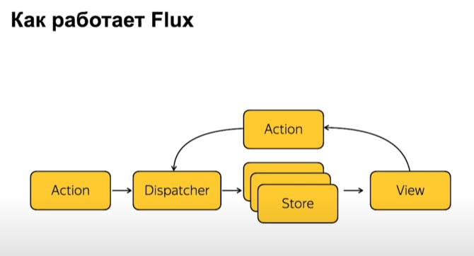
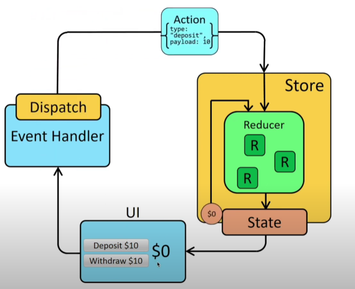

# **Redux**

## 1. **Что такое Flux?**

`Flux` — это архитектурный паттерн, разработанный Facebook, который используется для управления состоянием приложения. Он основан на однонаправленном потоке данных, что помогает избежать проблем, связанных с сложной логикой передачи данных в крупных приложениях. Flux состоит из четырех основных компонентов:

- `Actions` — объекты, описывающие, что произошло в приложении. Они содержат информацию о типе действия и данные, необходимые для его выполнения.
  
- `Dispatcher` — центральный хаб, который управляет обработкой действий и распределяет их к соответствующим Stores. Он обеспечивает последовательную обработку действий, гарантируя, что каждое действие будет передано всем хранилищам.

- `Stores` — хранилища, которые содержат состояние приложения и логику бизнес-правил. Они отвечают за управление состоянием и предоставление данных для Views. Stores также обрабатывают действия, отправленные через Dispatcher.

- `Views` — компоненты пользовательского интерфейса, которые подписываются на изменения в Stores и обновляются при изменении состояния. Views отвечают за отображение данных и взаимодействие с пользователем, передавая действия в Dispatcher.



Отличие Redux и Flux: 

Redux и Flux оба используются для управления состоянием в приложениях, но между ними есть несколько ключевых отличий. Redux более упрощён и строг в своей структуре: в нём есть одно глобальное хранилище, которое хранит всё состояние приложения, и изменения состояния происходят только через действия (actions) и редюсеры (reducers). Flux же предлагает более гибкую архитектуру с несколькими хранилищами (stores), и каждый store обрабатывает свои действия.

Кроме того, в Redux состояние неизменно (immutable), и для его изменения всегда создаётся новая копия, тогда как в Flux изменения могут быть сделаны напрямую в самих store. В Redux также применяется концепция middleware для обработки побочных эффектов, таких как асинхронные запросы, чего изначально в Flux не предусмотрено.

В Flux нет концепции редюсеров, как в Redux. В Flux используется другой подход: действия (actions) передаются диспетчеру (dispatcher), который отправляет их в соответствующие хранилища (stores). Эти хранилища содержат логику обработки действий и сами обновляют своё состояние. 

В отличие от Redux, где редюсеры чисто описывают, как изменяется состояние на основе действия, в Flux хранилища непосредственно изменяют своё состояние и могут хранить разные части данных независимо друг от друга.

## 2. **Что такое Redux? Ключевые принципы Redux?**

`Redux` — это менеджер состояния, библиотека для управления состоянием приложений, которая вдохновлена Flux. 
Ключевые принципы Redux:
- `Единый источник истины`:  Все данные о состоянии приложения хранятся в одном месте, без копий. Глобальное состояние организовано как дерево объектов и называется state tree. Также используются термины «источник состояния» и «хранилище». Оба означают местонахождение глобального состояния. Единый источник нужен для централизации и отладки приложения. Работа становится проще, если данные находятся в одном месте.
- `Состояние только для чтения`: Единственный способ изменить состояние — это вызвать действие (action).
- `Изменения — только через редьюсеры (reducer)`: Редьюсеры — это чистые функции, которые принимают текущее состояние и действие, а затем возвращают новое состояние. Они не изменяют существующий объект состояния, а создают его новую версию на основе данных, поступивших через действие.

## 3. **Что такое действие (Action)?**

`Действие (Action)` — это объект, который описывает изменение состояния в Redux. Обязательное свойство действия — это `type`, указывающее на тип изменения. Дополнительные данные передаются через `payload`.

```js
{
  type: 'ADD_TODO',
  payload: { text: 'Купить молоко' }
}

```

## 4. **Что такое диспетчер (Dispatch)?**

`Диспетчер (Dispatch)` — это метод, который используется для отправки действий (actions) в хранилище (store) Redux. Когда вызывается dispatch(action), хранилище передаёт это действие соответствующему редьюсеру, который вычисляет новое состояние на основе текущего состояния и типа действия.

## 5. **Что такое редьюсер (Reducer)?**

`Редьюсер (Reducer)` — это чистая функция, которая принимает текущее состояние и действие (action) в качестве аргументов и возвращает новое состояние. Редьюсер не изменяет исходное состояние, а создает и возвращает его копию с учётом изменений, описанных в действии.

Основная задача редьюсера — вычислить новое состояние на основе предыдущего состояния и типа действия.

## 6. **Что такое хранилище (Store)?**

`Хранилище (Store)` — это объект, который хранит состояние приложения и управляет его изменениями.

## 7. **Что такое мидлвейр (Middleware)?**

`Мидлвейр (Middleware)` — это промежуточный слой, который позволяет перехватывать и обрабатывать действия (actions) перед тем, как они достигнут редьюсеров (reducers). Мидлвейр предоставляет возможность добавлять дополнительную логику, например, для работы с асинхронными операциями, логирования действий, обработки ошибок и других задач, не нарушая основной архитектуры Redux.

## 7. **Разница между React State и Redux State?**

- State в React локален для компонента, тогда как Redux State глобален и доступен для всех компонентов приложения.
- React State управляется локально, с использованием `setState`, тогда как Redux State управляется через dispatching actions и редьюсеры.
- Для доступа к React State используются методы жизненного цикла компонента, тогда как Redux предоставляет механизм подписки через `connect` или `useSelector`.

## 8. **Как выглядит поток данных в Redux-приложении?**

1. Пользователь взаимодействует с интерфейсом (например, нажимает кнопку).
2. Срабатывает событие, которое вызывает соответствующий хендлер (action creator).
3. Action creator с помощью dispatch отправляет действие (action) в Store.
4. Store передает действие редьюсерам.
5. Редьюсеры обновляют состояние в зависимости от действия (action).
6. Компоненты, подписанные на изменения состояния, обновляются и отображают новое состояние.

Поток данных в Redux всегда однонаправлен.
Передача действий с потоками данных происходит через вызов метода dispatch() в хранилище. Само хранилище передаёт действия редуктору и генерирует следующее состояние, а затем обновляет состояние и уведомляет об этом всех слушателей.



## 9. **Преимущества и недостатки Redux?**

`Преимущества :`
- `Легкая работа с состоянием.` Redux реализован просто и элегантно, мало весит и при этом эффективно управляет состоянием. Его основную функциональность можно уместить в десять строчек кода. Пользоваться Redux удобнее, чем самостоятельно писать менеджер состояний.

- `Упрощение масштабирования.` Redux часто используют в связке с React, потому что в React не очень удобный встроенный алгоритм для управления состояниями. Его особенности приводят к тому, что приложение становится тяжело масштабировать. Redux решает эту проблему.

- `Простое изучение.` Если разработчик уже знает один из основных фреймворков для JavaScript либо «чистый» JS, ему будет просто начать работу с Redux. Обучающие материалы и уроки находятся в открытом доступе.

- `Множество полезных инструментов.` Для Redux существуют вспомогательные библиотеки и инструменты, которые сильно облегчают работу с приложениями. Компоненты модифицируют модель, описанную выше, или помогают работать с ней более гибко.

`Минусы:`
- Дополнительная сложность из-за необходимости создания действий и редьюсеров.
- Могут возникать проблемы с производительностью в больших приложениях, если не оптимизировать состояние.
- Некоторые разработчики могут считать его избыточным для небольших приложений.

## 10. **Отличие Redux и Context?**

`Redux` предназначен для управления сложным состоянием в приложениях с множеством компонентов, которые нуждаются в доступе к одному и тому же состоянию. Он предлагает структурированный подход с концепциями действий, редюсеров и хранилища, а также оптимизирован для производительности — только подписанные на конкретные части состояния компоненты перерисовываются. Легко масштабируется для крупных приложений, благодаря четкой структуре и экосистеме инструментов (например, Redux Toolkit, Redux DevTools). Использует middleware (например, Redux Thunk или Redux Saga) для управления побочными эффектами, что позволяет более четко организовать логику асинхронных операций.

`Context` позволяет передавать данные через дерево компонентов без необходимости передавать их через пропсы. Он проще в настройке и подходит для локального состояния или тем, но может привести к проблемам с производительностью, так как все компоненты, использующие контекст, перерисовываются при изменении значения. Может стать неуправляемым при росте приложения, так как управление сложным состоянием с помощью контекста может привести к запутанному коду. Не предоставляет встроенных средств для управления побочными эффектами, что может потребовать использование других библиотек.