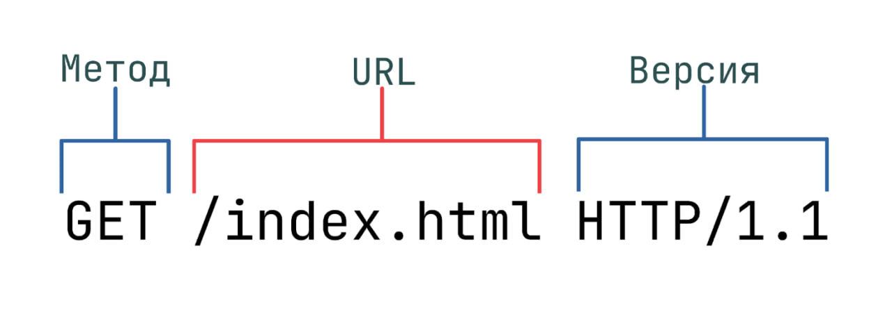

# **Web Tech**

## 1. **HTTP-запросы: структура, методы, строка статуса и коды состояния**

### **Базово о протоколе HTTP**

`HTTP` (HyperText Transfer Protocol, дословно — «протокол передачи гипертекста») представляет собой протокол прикладного
уровня, используемый для доступа к ресурсам Всемирной Паутины. Под термином гипертекст следует понимать текст, в
понятном для человека представлении, при этом содержащий ссылки на другие ресурсы.

Данный протокол описывается спецификацией `RFC 2616`. На сегодняшний день наиболее распространенной версией протокола
является версия **HTTP/2**, однако нередко все еще можно встретить более раннюю версию **HTTP/1.1**.

В обмене информацией по HTTP-протоколу принимают участие клиент и сервер. Происходит это по следующей схеме:

1. Клиент запрашивает у сервера некоторый ресурс.
2. Сервер обрабатывает запрос и возвращает клиенту ресурс, который был запрошен.


По умолчанию для коммуникации по HTTP используется порт 80, хотя вместо него может быть выбран и любой другой порт.
Многое зависит от конфигурации конкретного веб-сервера.

### HTTP-сообщения: запросы и ответы

Данные между клиентом и сервером в рамках работы протокола передаются с помощью HTTP-сообщений. Они бывают двух видов:

`Запросы (HTTP Requests)` — сообщения, которые отправляются клиентом на сервер, чтобы вызвать выполнение некоторых
действий. Зачастую для получения доступа к определенному ресурсу. Основой запроса является HTTP-заголовок.
`Ответы (HTTP Responses)` — сообщения, которые сервер отправляет в ответ на клиентский запрос.
Само по себе сообщение представляет собой информацию в текстовом виде, записанную в несколько строчек.

В целом, как запросы HTTP, так и ответы имеют следующую структуру:

1. `Стартовая строка (start line)` — используется для описания версии используемого протокола и другой информации —
   вроде
   запрашиваемого ресурса или кода ответа. Как можно понять из названия, ее содержимое занимает ровно одну строчку.
2. `HTTP-заголовки (HTTP Headers)` — несколько строчек текста в определенном формате, которые либо уточняют запрос, либо
   описывают содержимое тела сообщения.
3. `Пустая строка`, которая сообщает, что все метаданные для конкретного запроса или ответа были отправлены.
4. `Опциональное тело сообщения`, которое содержит данные, связанные с запросом, либо документ (например HTML-страницу),
   передаваемый в ответе.

### Стартовая строка HTTP-запроса:

1. `Метод HTTP-запроса` (method, реже используется термин verb). Обычно это короткое слово на английском, которое
   указывает, что конкретно нужно сделать с запрашиваемым ресурсом. Например, метод GET сообщает серверу, что
   пользователь хочет получить некоторые данные, а POST — что некоторые данные должны быть помещены на сервер.
2. `Цель запроса.` Представлена указателем ресурса URL, который состоит из протокола, доменного имени (или IP-адреса),
   пути к конкретному ресурсу на сервере. Дополнительно может содержать указание порта, несколько параметров
   HTTP-запроса и еще ряд опциональных элементов.
3. `Версия используемого протокола` (либо HTTP/1.1, либо HTTP/2), которая определяет структуру следующих за стартовой
   строкой данных.



### Методы HTTP

Методы позволяют указать конкретное действие, которое мы хотим, чтобы сервер выполнил, получив наш запрос. Так,
некоторые методы позволяют браузеру (который в большинстве случаев является источником запросов от клиента) отправлять
дополнительную информацию в теле запроса — например, заполненную форму или документ.

Ниже приведены наиболее используемые методы и их описание:

| Метод                 | Идемпотентность            | Назначение                                                                                                                                                 |
|-----------------------|----------------------------|------------------------------------------------------------------------------------------------------------------------------------------------------------|
| **GET**               | Идемпотентный              | Позволяет запросить конкретный ресурс. Дополнительные данные могут быть переданы через строку запроса (Query String) в URL (например, `?param=value`).     |
| **POST**              | Неидемпотентный            | Позволяет отправить данные на сервер, включая текст, PDF и другие типы файлов. Часто используется для отправки форм и загрузки данных.                     |
| **PUT**               | Идемпотентный              | Используется для создания или обновления ресурсов на сервере. Неправильная настройка может привести к проблемам безопасности.                              |
| **DELETE**            | Идемпотентный              | Позволяет удалить ресурс. Некорректное использование может вызвать отказ в обслуживании (DoS) из-за удаления важных файлов.                                |
| **HEAD**              | Идемпотентный              | Запрашивает только заголовки ресурса, как при использовании GET, но без тела ответа. Полезно для проверки размера ресурса перед загрузкой.                 |
| **OPTIONS**           | Идемпотентный              | Запрашивает информацию о сервере, включая поддерживаемые HTTP-методы.                                                                                      |
| **PATCH**             | Неидемпотентный (частично) | Позволяет внести частичные изменения в ресурс. Может считаться частично идемпотентным.                                                                     |
| **CONNECT**           | Неидемпотентный            | Создает туннель связи, например, для HTTPS через прокси. Используется для установки TLS-соединения.                                                        |
| **TRACE**             | Идемпотентный              | Выполняет обратный запрос, отображая путь запроса через промежуточные серверы. Используется для отладки, но редко разрешен из-за соображений безопасности. |
| **LINK** / **UNLINK** | Идемпотентные              | Предлагают связать или разорвать связь между ресурсами, используются в системах управления контентом и других специфических сценариях.                     |

`Идемпотентность` — это свойство операции, при котором несколько её повторных выполнений дают одинаковый результат. В
HTTP
это означает, что повторный запрос с одинаковыми параметрами не изменит состояние ресурса. Например, методы GET, PUT и
DELETE идемпотентны, потому что их повторение не приведет к разным результатам. В то время как POST и PATCH могут
изменять данные при каждом запросе, и их повторение может привести к разным результатам.

### URL

Получение доступа к ресурсам по HTTP-протоколу осуществляется с помощью указателя URL (Uniform Resource Locator). URL
представляет собой строку, которая позволяет указать запрашиваемый ресурс и еще ряд параметров.

Использование URL неразрывно связано с другими элементами протокола, поэтому далее мы рассмотрим его основные компоненты
и строение:

Поле **Scheme** используется для указания используемого протокола, всегда сопровождается двоеточием и двумя косыми
чертами (://).

**Host** указывает местоположение ресурса, в нем может быть как доменное имя, так и IP-адрес.

**Port**, как можно догадаться, позволяет указать номер порта, по которому следует обратиться к серверу. Оно начинается
с
двоеточия (:), за которым следует номер порта. При отсутствии данного элемента номер порта будет выбран по умолчанию в
соответствии с указанным значением Scheme (например, для http:// это будет порт 80).

Далее следует поле **Path**. Оно указывает на ресурс, к которому производится обращение. Если данное поле не указано, то
сервер в большинстве случаев вернет указатель по умолчанию (например index.html).

Поле **Query String** начинается со знака вопроса (?), за которым следует пара «параметр-значение», между которыми
расположен символ равно (=). В поле Query String могут быть переданы несколько параметров с помощью символа
амперсанд (&) в качестве разделителя.

Не все компоненты необходимы для доступа к ресурсу. Обязательно следует указать только поля **Scheme** и **Host**.

#### Версии HTTP

Последняя стабильная, наиболее стандартизированная версия протокола первого поколения (версия HTTP/1.1) вышла в далеком
1997 году. Годы шли, веб-страницы становились сложнее, некоторые из них даже стали приложениями в том виде, в котором мы
понимаем их сейчас. Кроме того, объем медиафайлов и скриптов, которые добавляли интерактивность страницам, рос. Это, в
свою очередь, создавало перегрузки в работе протокола версии HTTP/1.1.

Стало очевидно, что у HTTP/1.1 есть ряд значительных недостатков:

Заголовки, в отличие от тела сообщения, передавались в несжатом виде.
Часто большая часть заголовков в сообщениях совпадала, но они продолжали передаваться по сети.
Отсутствовала возможность так называемого мультиплексирования — механизма, позволяющего объединить несколько соединений
в один поток данных. Приходилось открывать несколько соединений на сервере для обработки входящих запросов.
С выходом HTTP/2 было предложено следующее решение: HTTP/1.X-сообщения разбивались на так называемые фреймы, которые
встраивались в поток данных.

Фреймы данных (тела сообщения) отделялись от фреймов заголовка, что позволило применять сжатие. Вместе с появлением
потоков появился и ранее описанный механизм мультиплексирования — теперь можно было обойтись одним соединением для
нескольких потоков.

Единственное о чем стоит сказать в завершение темы: HTTP/2 перестал быть текстовым протоколом, а стал работать с «сырой»
двоичной формой данных. Это ограничивает чтение и создание HTTP-сообщений «вручную». Однако такова цена за возможность
реализации более совершенной оптимизации и повышения производительности.

### Заголовки

**HTTP-заголовок** представляет собой строку формата «Имя-Заголовок:Значение», с двоеточием(:) в качестве разделителя.
Название заголовка не учитывает регистр, то есть между Host и host, с точки зрения HTTP, нет никакой разницы. Однако в
названиях заголовков принято начинать каждое новое слово с заглавной буквы. Структура значения зависит от конкретного
заголовка. Несмотря на то, что заголовок вместе со значениями может быть достаточно длинным, занимает он всего одну
строчку.

В запросах может передаваться большое число различных заголовков, но все их можно разделить на три категории:

1. `Общего назначения`, которые применяются ко всему сообщению целиком.
2. `Заголовки запроса` уточняют некоторую информацию о запросе, сообщая дополнительный контекст или ограничивая его
   некоторыми логическими условиями.
3. `Заголовки представления`, которые описывают формат данных сообщения и используемую кодировку. Добавляются к запросу
   только в тех случаях, когда с ним передается некоторое тело.


| Заголовок         | Назначение                                                                                                                                                                                |
|-------------------|-------------------------------------------------------------------------------------------------------------------------------------------------------------------------------------------|
| **Host**          | Указывает, с какого конкретно хоста запрашивается ресурс. Может содержать доменные имена или IP-адреса. Требуется для доступа к конкретному сайту на одном сервере с несколькими сайтами. |
| **User-Agent**    | Описывает клиента, запрашивающего ресурс, включая браузер, его версию и операционную систему.                                                                                             |
| **Refer**         | Указывает, откуда поступил текущий запрос. Например, если переход по ссылке происходит с другого сайта, то этот сайт будет указан в заголовке Refer.                                      |
| **Accept**        | Позволяет указать типы медиафайлов, которые принимает клиент. Несколько типов могут быть перечислены через запятую, а `*/*` означает, что клиент принимает любые типы.                    |
| **Cookie**        | Содержит пары «Куки-Значение» для идентификации и хранения пользовательских данных. Куки поддерживают сессию клиента и хранятся на стороне клиента и сервера.                             |
| **Authorization** | Используется для аутентификации клиента на сервере. После успешной аутентификации сервер возвращает токен, который хранится у клиента и отправляется по запросу.                          |

### Тело запроса

Завершающая часть HTTP-запроса — это его тело. Не у каждого HTTP-метода предполагается наличие тела. Так, например,
методам вроде GET, HEAD, DELETE, OPTIONS обычно не требуется тело. Некоторые виды запросов могут отправлять данные на
сервер в теле запроса: самый распространенный из таких методов — POST.

### **Ответы HTTP (HTTP Responses)**

**HTTP-ответ** является сообщением, которое сервер отправляет клиенту в ответ на его запрос. Его структура равна
структуре
HTTP-запроса: стартовая строка, заголовки и тело.

### Строка статуса (Status line)

Стартовая строка HTTP-ответа называется **строкой статуса (status line)**. На ней располагаются следующие элементы:

1. Уже известная нам по стартовой строке запроса `версия протокола` (HTTP/2 или HTTP/1.1).
2. `Код состояния`, который указывает, насколько успешно завершилась обработка запроса.
3. `Пояснение` — короткое текстовое описание к коду состояния. Используется исключительно для того, чтобы упростить
   понимание
   и восприятие человека при просмотре ответа.


### Коды HTTP

Коды состояния HTTP используются для того, чтобы сообщить клиенту статус их запроса. HTTP-сервер может вернуть код,
принадлежащий одной из пяти категорий кодов состояния:

| Категория | Код состояния                     | Описание                                                                                                    |
|-----------|-----------------------------------|-------------------------------------------------------------------------------------------------------------|
| **1xx**   | **Информационные**                | Коды из данной категории носят исключительно информативный характер и никак не влияют на обработку запроса. |
|           | 100 Continue                      | Продолжайте запрос.                                                                                         |
|           | 101 Switching Protocols           | Переключение протоколов.                                                                                    |
| **2xx**   | **Успешные**                      | Коды состояния из этой категории возвращаются в случае успешной обработки клиентского запроса.              |
|           | 200 OK                            | Возвращается в случае успешной обработки запроса, при этом тело ответа обычно содержит запрошенный ресурс.  |
|           | 201 Created                       | Ресурс был успешно создан.                                                                                  |
|           | 202 Accepted                      | Запрос принят, но еще не обработан.                                                                         |
|           | 203 Non-Authoritative Information | Ответ, содержащий информацию, не являющуюся авторитетной.                                                   |
|           | 204 No Content                    | Запрос выполнен, но нет содержимого для возвращения.                                                        |
|           | 205 Reset Content                 | Запрос выполнен, клиент должен сбросить представление документа.                                            |
|           | 206 Partial Content               | Сервер возвращает только часть запрашиваемого ресурса.                                                      |
| **3xx**   | **Перенаправления**               | Эта категория содержит коды, которые возвращаются, если серверу нужно перенаправить клиента.                |
|           | 300 Multiple Choices              | Несколько вариантов для ресурса.                                                                            |
|           | 301 Moved Permanently             | Ресурс был перемещен на постоянной основе.                                                                  |
|           | 302 Found                         | Перенаправляет клиента на другой URL, например, после успешной аутентификации.                              |
|           | 303 See Other                     | Необходимо получить ресурс по другому URI с использованием метода GET.                                      |
|           | 304 Not Modified                  | Запрашиваемый ресурс не изменялся с момента последнего запроса.                                             |
|           | 305 Use Proxy                     | Ресурс должен быть доступен только через прокси.                                                            |
|           | 307 Temporary Redirect            | Временное перенаправление на другой URI, используйте тот же метод.                                          |
|           | 308 Permanent Redirect            | Постоянное перенаправление на другой URI, используйте тот же метод.                                         |
| **4xx**   | **Ошибки клиента**                | Коды данной категории означают, что на стороне клиента был отправлен некорректный запрос.                   |
|           | 400 Bad Request                   | Запрос был сформирован с ошибками, например, отсутствовали символы завершения строки.                       |
|           | 401 Unauthorized                  | Для доступа к ресурсу требуется аутентификация.                                                             |
|           | 402 Payment Required              | Зарезервировано для будущего использования (обычно для платных API).                                        |
|           | 403 Forbidden                     | Клиент не обладает достаточными правами доступа к ресурсу или обнаружены вредоносные данные.                |
|           | 404 Not Found                     | Запрашиваемый ресурс не существует на сервере.                                                              |
|           | 405 Method Not Allowed            | Метод, указанный в запросе, не разрешен для данного ресурса.                                                |
|           | 406 Not Acceptable                | Сервер не может предоставить ресурс, подходящий под условия запроса.                                        |
|           | 407 Proxy Authentication Required | Необходима аутентификация через прокси.                                                                     |
|           | 408 Request Timeout               | Время ожидания запроса истекло.                                                                             |
|           | 409 Conflict                      | Конфликт с текущим состоянием ресурса.                                                                      |
|           | 410 Gone                          | Запрашиваемый ресурс был удален и больше недоступен.                                                        |
|           | 411 Length Required               | Необходим заголовок Content-Length.                                                                         |
|           | 412 Precondition Failed           | Предусловие в заголовке запроса не выполнено.                                                               |
|           | 413 Payload Too Large             | Размер запроса превышает лимит, установленный сервером.                                                     |
|           | 414 URI Too Long                  | Запрашиваемый URI слишком длинный для обработки сервером.                                                   |
|           | 415 Unsupported Media Type        | Неподдерживаемый тип медиа в запросе.                                                                       |
|           | 416 Range Not Satisfiable         | Запрашиваемый диапазон недоступен.                                                                          |
|           | 417 Expectation Failed            | Ожидание, указанное в заголовке Expect, не было выполнено.                                                  |
| **5xx**   | **Ошибки сервера**                | Ответ с кодами из этой категории приходит, если на стороне сервера возникла ошибка.                         |
|           | 500 Internal Server Error         | Сервер не может обработать запрос по определенным причинам.                                                 |
|           | 501 Not Implemented               | Сервер не поддерживает функциональность, необходимую для выполнения запроса.                                |
|           | 502 Bad Gateway                   | Сервер, действующий как шлюз, получил неверный ответ от вышестоящего сервера.                               |
|           | 503 Service Unavailable           | Сервер временно недоступен, например, из-за перегрузки.                                                     |
|           | 504 Gateway Timeout               | Время ожидания ответа от вышестоящего сервера истекло.                                                      |
|           | 505 HTTP Version Not Supported    | Версия HTTP, указанная в запросе, не поддерживается сервером.                                               |

### Заголовки ответа

Response Headers, или заголовки ответа, используются для того, чтобы уточнить ответ, и никак не влияют на содержимое
тела. Они существуют в том же формате, что и остальные заголовки, а именно «Имя-Значение» с двоеточием (:) в качестве
разделителя.

Ниже приведены наиболее часто встречаемые в ответах заголовки:

| Категория        | Пример                                    | Описание                                                                                                                          |
|------------------|-------------------------------------------|-----------------------------------------------------------------------------------------------------------------------------------|
| Server           | Server: nginx                             | Содержит информацию о сервере, который обработал запрос.                                                                          |
| Set-Cookie       | Set-Cookie: PHPSSID=bf42938f              | Содержит куки, требуемые для идентификации клиента. Браузер парсит куки и сохраняет их в своем хранилище для дальнейших запросов. |
| WWW-Authenticate | WWW-Authenticate: BASIC realm="localhost" | Уведомляет клиента о типе аутентификации, который необходим для доступа к запрашиваемому ресурсу.                                 |

## Тело ответа

Последней частью ответа является его тело. Несмотря на то, что у большинства ответов тело присутствует, оно не является
обязательным. Например, у кодов «201 Created» или «204 No Content» тело отсутствует, так как достаточную информацию для
ответа на запрос они передают в заголовке.

### Безопасность HTTP-запросов, или что такое HTTPs

**HTTP** является расширяемым протоколом, который предоставляет огромное количество возможностей, а также поддерживает
передачу всевозможных типов файлов. Однако, вне зависимости от версии, у него есть один существенный недостаток, который
можно заметить если перехватить отправленный HTTP-запрос:


Да, все верно: данные передаются в открытом виде. HTTP сам по себе не предоставляет никаких средств шифрования.

Но как же тогда работают различные банковские приложения, интернет-магазины, сервисы оплаты услуг и прочие приложения, в
которых циркулирует чувствительная информация пользователей?

Время рассказать про HTTPs!

**HTTPs (HyperText Transfer Protocol, secure)** является расширением HTTP-протокола, который позволяет шифровать
отправляемые данные, перед тем как они попадут на транспортный уровень. Данный протокол по умолчанию использует порт

443.

Теперь если мы перехватим не HTTP, а HTTPs-запрос, то не увидим здесь ничего интересного:


Данные передаются в едином зашифрованном потоке, что делает невозможным получение учетных данных пользователей и прочей
критической информации средствами обычного перехвата.

### Почему http-2, а не http-1 ?

HTTP/2 предпочтительнее HTTP/1.1 потому, что он позволяет мультиплексирование запросов по одному соединению, сжимает
заголовки для эффективности передачи данных и улучшает общую производительность веб-сайтов за счет бинарного формата и
приоритизации потоков.

`Минусы`

Ограниченное количество одновременных соединений:
HTTP/1.1 позволяет использовать несколько одновременных соединений для загрузки ресурсов с одного домена, но это число
ограничено (обычно 6-8 соединений). Это приводит к значительным задержкам, особенно при загрузке большого количества
ресурсов (изображений, скриптов, стилей) на современных веб-страницах.

Небольшие размеры заголовков:
В HTTP/1.x заголовки передаются в каждом запросе и ответе, что увеличивает накладные расходы, особенно при использовании
длинных куки-файлов и других данных заголовков.

Отсутствие мультиплексирования:
HTTP/1.x не поддерживает отправку нескольких запросов и ответов одновременно по одному соединению, что приводит к
блокировке при медленных запросах или больших ресурсах.

Частые разрывы соединений:
В HTTP/1.x соединения часто закрываются после завершения передачи данных, что требует повторного установления соединений
для последующих запросов, увеличивая задержки.

`Плюсы`

Бинарный протокол:
HTTP/2 использует бинарное кодирование вместо текстового в HTTP/1.x, что упрощает анализ и обработку данных, а также
снижает вероятность ошибок.

Мультиплексирование:
HTTP/2 позволяет отправлять несколько запросов и получать несколько ответов одновременно по одному TCP-соединению,
устраняя блокировку и повышая эффективность передачи данных.

Сжатие заголовков (HPACK):
HTTP/2 использует эффективное сжатие заголовков, что значительно уменьшает накладные расходы при передаче заголовков.

Приоритеты потоков:
HTTP/2 поддерживает установку приоритетов для отдельных потоков данных, что позволяет более эффективно управлять
передачей важных ресурсов.

Постоянные соединения:
HTTP/2 поддерживает длительные соединения, что уменьшает количество повторных установлений соединений и улучшает
производительность.

Серверная инициатива (Server Push):
HTTP/2 позволяет серверу отправлять ресурсы клиенту до того, как они будут запрошены, что ускоряет загрузку страниц.

Примеры преимуществ HTTP/2

Мультиплексирование:
В HTTP/1.1 каждый запрос требует отдельного соединения или использования техники keep-alive для удержания соединения
открытым, что приводит к блокировке. В HTTP/2, благодаря мультиплексированию, все ресурсы могут быть загружены
одновременно по одному соединению.

Сжатие заголовков:
Заголовки в HTTP/2 сжимаются, что особенно полезно для повторяющихся заголовков, таких как куки.

Server Push:
Сервер может отправлять необходимые ресурсы, такие как стили и скрипты, до того, как клиент их запросит, что снижает
количество запросов и улучшает время загрузки страницы.

## 2. **Webpack**

`Webpack` — это инструмент для сборки модулей JavaScript. Он помогает собрать различные файлы (JavaScript, CSS,
изображения и т.д.) в единый или несколько оптимизированных файлов для ускорения загрузки и улучшения производительности
приложения.

Основные концепции Webpack:

1. Tree Shaking — это техника оптимизации, которая удаляет неиспользуемый код из конечного бандла. В процессе сборки
   Webpack анализирует зависимости и исключает модули, которые не используются в коде. Это помогает уменьшить размер
   итогового файла и сократить время загрузки приложения.

2. Code splitting (Чанки) — это отдельные части кода, которые Webpack генерирует при сборке. Чанки могут быть динамическими и
   статическими:
    - Статические чанки (entry chunks) генерируются из точек входа (entry points), определенных в конфигурации Webpack.
      Эти чанки загружаются при начальной загрузке приложения.
    - Динамические чанки (lazy-loaded chunks) создаются при динамическом импорте модулей и загружаются только по мере
      необходимости (например, когда пользователь переходит на определенную страницу или вызывает конкретную функцию).
      Это позволяет сократить первоначальный объем кода, загружаемого на клиенте.

3. Проксирование — это техника, часто используемая в настройках для разработки. Она позволяет перенаправлять запросы на
   другой сервер. Например, если у вас есть frontend-приложение, работающее на Webpack Dev Server, но backend находится
   на другом сервере, Webpack может проксировать запросы к backend-серверу для работы в единой среде.

как можно настроить через вебпак

## 3. Политика одинакового источника (same-origin policy)

`Политика одинакового источника (same-origin policy)` определяет как документ или скрипт, загруженный из одного
источника (origin), может взаимодействовать с ресурсом из другого источника. Это помогает изолировать потенциально
вредоносные документы, снижая количество возможных векторов атак.

## 4. **CORS**

`CORS (Cross-Origin Resource Sharing, рус. "Совместное использование ресурсов между разными источниками")` - это
система,
состоящая из отправки HTTP заголовков, которые определяют: заблокировать или выполнить запрос к ограниченному ресурсу на
веб-странице из другого домена, отличного от домена происхождения запрашиваемого ресурса.

## 5. **JWT**

`JWT` авторизация - это надо посидеть позаниматься на практике + переписать то что говорил Руслан

## 8. **Методы для хранения данных в браузере?**

`LocalStorage и SessionStorage` используются для хранения пар ключ-значение. Данные, сохраненные в них, сохраняются
после
обновления страницы. При этом только LocalStorage может сохранять данные после перезапуска браузера. Оба хранилища могут
использовать только строки в качестве ключей и значений, поэтому объекты необходимо преобразовать с помощью
JSON.stringify().

`Cookie` – небольшие строки данных, которые хранятся в браузере. Cookie обычно устанавливаются веб-сервером с
использованием заголовка Set-Cookie. Браузер затем автоматически добавляет их почти ко всем запросам на тот же домен с
использованием заголовка Cookie. Один экземпляр cookie может содержать до 4 кб данных. В зависимости от браузера,
допускается более 20 cookie на сайт.

`IndexedDB` – встроенная база данных, более мощная, чем LocalStorage. Это NoSQL-хранилище данных в формате JSON внутри
браузера, где доступны несколько типов ключей, а значения могут быть практически любым. IndexedDB поддерживает
асинхронный доступ, транзакции для обеспечения согласованности данных и создание индексов для эффективного поиска.
Позволяет хранить больше данных, чем LocalStorage, может быть связана с Service Workers и другими технологиями, которые
обеспечивают функционирование PWA в оффлайне.

## 9. **Что происходит, когда вводим запрос в адресную строку браузера?**

1. DNS-резолвинг (Domain Name System)
   Адрес, который вы ввели, например, example.com, — это доменное имя. Браузер должен определить, к какому IP-адресу оно
   привязано. Для этого он обращается к системе DNS, которая преобразует доменное имя в IP-адрес сервера, где находится
   сайт. Если DNS-запись не кэширована, браузер отправляет запрос на ближайший DNS-сервер, начиная с локального (
   например, маршрутизатора) и заканчивая глобальными DNS-серверами.

2. Установление TCP-соединения
   После получения IP-адреса браузер открывает соединение с сервером. Для этого используется TCP (Transmission Control
   Protocol), чтобы установить устойчивое и надежное соединение. Этот процесс включает в себя трехстороннее рукопожатие:
    - Браузер отправляет SYN-запрос (Synchronize).
    - Сервер отвечает SYN-ACK (Synchronize Acknowledge).
    - Браузер подтверждает соединение, отправив ACK.

3. Начало TLS-шифрования (если используется HTTPS)
   Если соединение использует HTTPS, то происходит процесс шифрования с использованием TLS (Transport Layer Security).
   Этот процесс включает обмен ключами для защиты данных, передаваемых между браузером и сервером.

4. Отправка HTTP-запроса
   После установления безопасного соединения браузер отправляет HTTP-запрос (чаще всего это GET-запрос) на сервер с
   запросом на конкретный ресурс, например HTML-документ, изображение или другой контент. Запрос может содержать
   заголовки, cookies и другую информацию, необходимую для корректной обработки сервером.

5. Ответ сервера (HTTP-response)
   Сервер принимает запрос и отправляет в ответ HTTP-ответ, который содержит:
    - Код статуса (например, 200 — OK, 404 — Not Found).
    - Тело ответа — сам ресурс, запрашиваемый браузером (например, HTML-код страницы).
    - Заголовки — метаданные, такие как тип содержимого (Content-Type), время кэширования, cookies и т. д.

6. Парсинг и рендеринг контента
   Браузер получает ответ и начинает его обрабатывать. Этот процесс включает:
    - Парсинг HTML — браузер строит DOM-дерево на основе HTML-кода.
    - Парсинг CSS — стили применяются к DOM-элементам.
    - Выполнение JavaScript — если на странице есть скрипты, браузер выполняет их. В процессе выполнения могут быть
      отправлены дополнительные запросы на сервер (например, для загрузки изображений, CSS-файлов или данных через
      AJAX).
    - Отрисовка (рендеринг) — браузер рендерит контент на экране, преобразуя DOM-дерево и стили в пиксели.

7. Обработка последующих запросов
   Если HTML-документ содержит ссылки на другие ресурсы (CSS, изображения, шрифты, JavaScript-файлы), браузер отправляет
   дополнительные HTTP-запросы для их загрузки. Эти ресурсы могут загружаться параллельно.

8. Отображение страницы
   После завершения всех вышеописанных шагов и рендеринга всех ресурсов, веб-страница полностью отображается на экране.

9. Кэширование
   Во время загрузки страницы браузер кэширует ресурсы (например, изображения, CSS, JavaScript-файлы), чтобы при
   повторных запросах загружать их быстрее, минуя полное повторное обращение к серверу.

## 10. **Стадии работы браузера**

1. Обработка (Parsing): Браузер сначала загружает HTML и CSS, затем создает DOM (Document Object Model) и CSSOM (CSS
   Object Model).

2. Составление (Compositing): Браузер объединяет DOM и CSSOM в один "ресурс" — рендер-дерево, которое содержит только те
   элементы, которые необходимо визуализировать.

3. Расчет (Layout): На этом этапе браузер определяет размеры и положения всех видимых элементов. Это также называется "
   первая отрисовка" (Reflow). Любое изменение, которое требует перерасчета размеров или позиций элементов, инициирует
   эту стадию.

4. Перерисовка (Painting): После расчета вырисовываются элементы на сайте (текст, цвета, изображения и т.д.). Изменения,
   которые не затрагивают размеры или положение элементов, могут вызвать только эту стадию.

5. Композиция (Compositing): На последнем этапе браузер складывает отдельные слои (например, фоны, текст, изображения) и
   отображает их на экране.

## 11. **Как поддерживать постоянное соединение?**

1. WebSockets:

- WebSockets позволяют установить двустороннее постоянное соединение между клиентом и сервером. Это полезно для
  приложений, требующих реального времени, таких как чаты или игры.
- Как это работает:
    1. Клиент инициирует соединение через HTTP-запрос с заголовком Upgrade.
    2. Сервер принимает запрос и устанавливает постоянное соединение.
    3. После установки соединения обе стороны могут отправлять данные в любое время.

Пример с использованием WebSocket в React:

```js
import {useEffect, useState} from "react";

const WebSocketExample = () => {
    const [messages, setMessages] = useState([]);
    const [socket, setSocket] = useState(null);

    useEffect(() => {
        const ws = new WebSocket("ws://example.com/socket");
        setSocket(ws);

        ws.onmessage = (event) => {
            setMessages((prevMessages) => [...prevMessages, event.data]);
        };

        return () => {
            ws.close();
        };
    }, []);

    return (
        <div>
            <h2>Messages</h2>
            {messages.map((msg, index) => (
                <p key={index}>{msg}</p>
            ))}
        </div>
    );
};

export default WebSocketExample;
```

2. Server-Sent Events (SSE):

- SSE — это односторонний канал, где сервер может отправлять обновления клиенту через HTTP-соединение.
- SSE хорошо подходит для приложений, где сервер регулярно отправляет данные (например, обновления ленты новостей).

Пример с использованием SSE в React:

```js
import {useEffect, useState} from "react";

const SSEExample = () => {
    const [data, setData] = useState([]);

    useEffect(() => {
        const eventSource = new EventSource("http://example.com/sse");

        eventSource.onmessage = (event) => {
            setData((prevData) => [...prevData, event.data]);
        };

        return () => {
            eventSource.close();
        };
    }, []);

    return (
        <div>
            <h2>Data from SSE</h2>
            {data.map((item, index) => (
                <p key={index}>{item}</p>
            ))}
        </div>
    );
};

export default SSEExample;
```

3. Long Polling:

- При использовании long polling клиент отправляет запрос на сервер, сервер не отвечает сразу, а задерживает ответ
  до появления новых данных.
- Это более старый подход по сравнению с WebSocket и SSE, но все еще может быть полезен для некоторых сценариев.

Пример с использованием long polling:

```js
import {useEffect, useState} from "react";
import axios from "axios";

const LongPollingExample = () => {
    const [data, setData] = useState([]);

    const pollData = async () => {
        try {
            const response = await axios.get("http://example.com/long-polling");
            setData((prevData) => [...prevData, response.data]);
            pollData(); // Запрашиваем данные снова после получения ответа
        } catch (error) {
            console.error(error);
        }
    };

    useEffect(() => {
        pollData();
    }, []);

    return (
        <div>
            <h2>Data from Long Polling</h2>
            {data.map((item, index) => (
                <p key={index}>{item}</p>
            ))}
        </div>
    );
};

export default LongPollingExample;
```

Какой из подходов выбрать?

- WebSocket — лучший выбор для приложений с интенсивным обменом данными в реальном времени (чаты, онлайн-игры).
- SSE — для приложений, где сервер отправляет обновления данных (ленты новостей, уведомления).
- Long Polling — используется реже, но может быть полезен там, где WebSocket или SSE не поддерживаются.